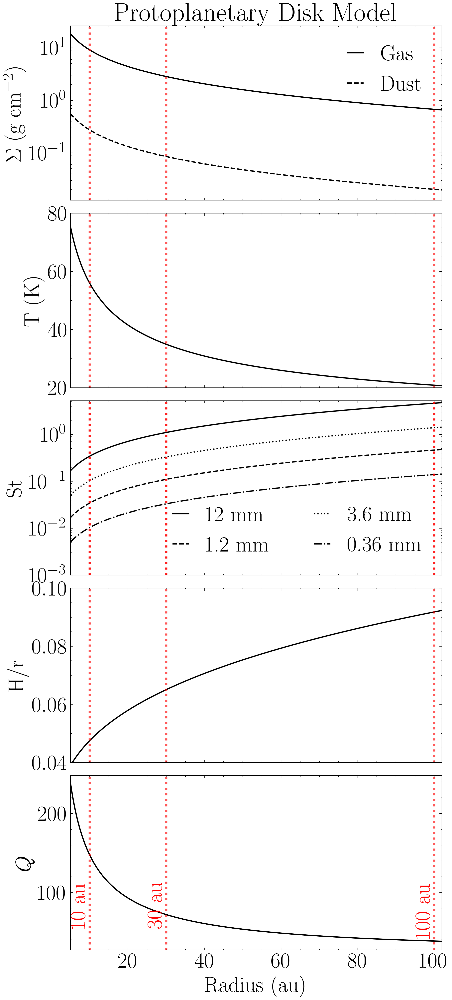
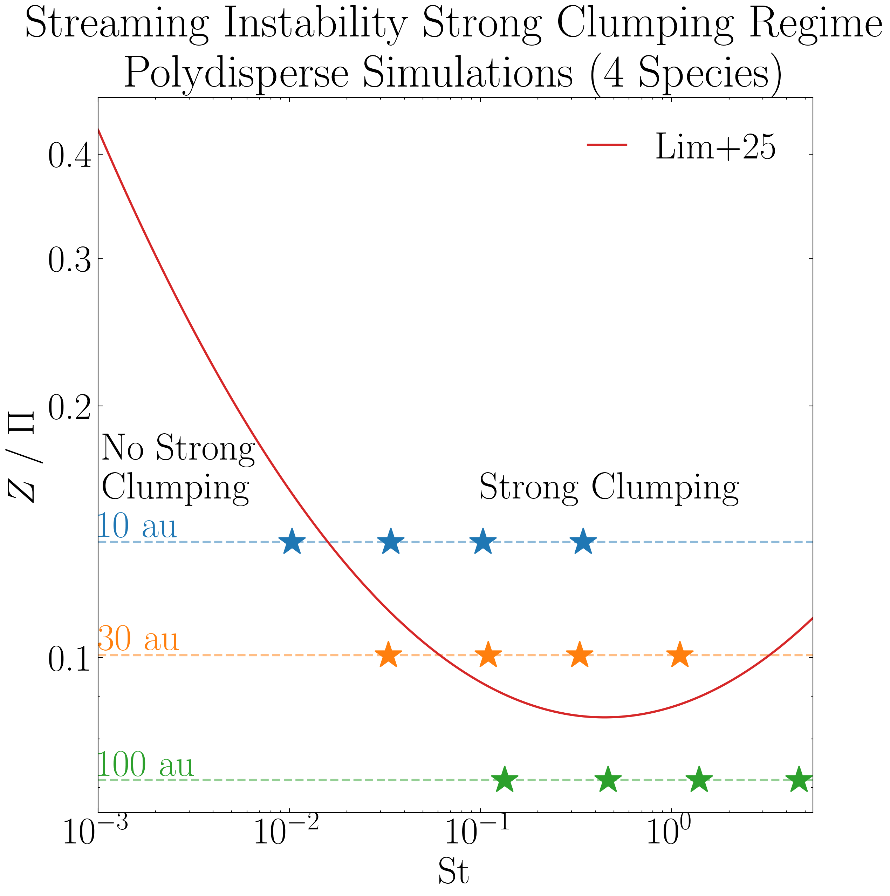
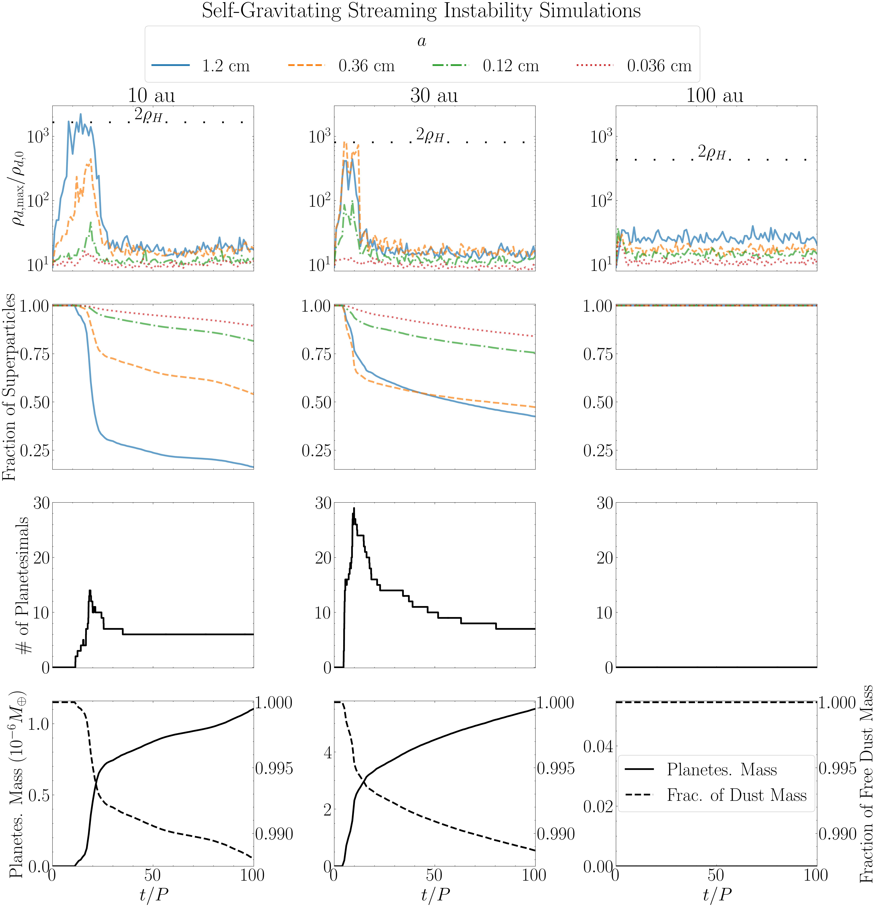
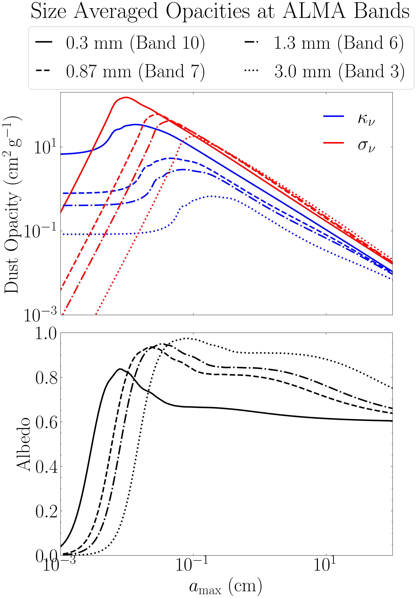
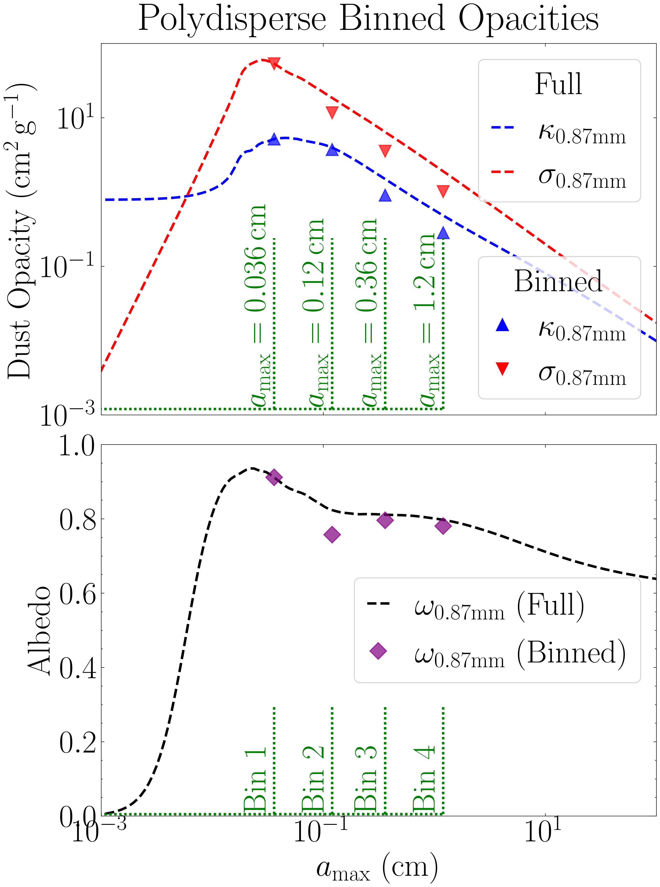

.. _Godines_et_al_2025:

Godines et al. 2025
===========

Figure 1 - Disk Model
-----------

The following code shows how we set up our disk model using the `disk_model <https://protort.readthedocs.io/en/latest/autoapi/protoRT/disk_model/index.html>`_ module. This model was used to configure the simulations, including the calculation of the stokes numbers, pressure gradient parameter and strength of the self-gravity at the three different disk locations. Note that the `Model <https://protort.readthedocs.io/en/latest/autoapi/protoRT/disk_model/index.html#protoRT.disk_model.Model>`_ class object containts the ``get_params`` method which prints the calculated disk parameters.

.. code-block:: python

	import numpy as  np 
	import matplotlib.pyplot as plt  
	import astropy.constants as const
	from protoRT import disk_model

	try:
	    import scienceplots
	    plt.style.use('science')
	    plt.rcParams.update({'font.size': 26,})
	    plt.rcParams.update({'lines.linewidth': 1.5})
	except:
	    print('WARNING: Could not import scienceplots, please install via pip for proper figure formatting.')
	    plt.style.use('default')

	# Mass of the star 
	M_star = const.M_sun.cgs.value 

	# Mass of the protoplanetary disk
	M_disk = 0.02*const.M_sun.cgs.value 

	# Radii which to model, and the characteristic radius of the disk (in [au])
	r, r_c = np.arange(5,110.25,0.25), 300 

	# Convert to cgs units 
	r, r_c = r*const.au.cgs.value, r_c*const.au.cgs.value 

	## Disk model adopted in this work (Section 2.1 of the paper) ##
	## Used to convert our multi-species simulations with self-gravity from code units to physical units (cgs) ###

	# Internal dust grain density (from DSHARP dust model)
	grain_rho = 1.675

	# Dust to gas ratio (Equation 11)
	Z = 0.03 

	# Temperature power law index (Equation 2)
	q = 3/7. 

	# Temperature at r = 1 au (Equation 2)
	T0 = 150 

	# The sizes of the four dust grains in our simulations
	grain_sizes = np.array([1.194, 0.3582, 0.1194, 0.03582]) 

	# The Model class in the disk_model module only works with one grain size, so we define four unique models 
	# All other model parameteres are the same so these models only differ in their respective Stokes number
	model_2a = disk_model.Model(r, r_c, M_star, M_disk, grain_rho=grain_rho, grain_size=grain_sizes[0], Z=Z, stoke=None, q=q, T0=T0)
	model_2b = disk_model.Model(r, r_c, M_star, M_disk, grain_rho=grain_rho, grain_size=grain_sizes[1], Z=Z, stoke=None, q=q, T0=T0)
	model_2c = disk_model.Model(r, r_c, M_star, M_disk, grain_rho=grain_rho, grain_size=grain_sizes[2], Z=Z, stoke=None, q=q, T0=T0)
	model_2d = disk_model.Model(r, r_c, M_star, M_disk, grain_rho=grain_rho, grain_size=grain_sizes[3], Z=Z, stoke=None, q=q, T0=T0)

	# Plot 
	fig, axes = plt.subplots(nrows=5, ncols=1, figsize=(8, 20), sharex=True)
	fig.subplots_adjust(hspace=0.075) 

	# Plot 1: Surface Density
	axes[0].plot(model_2a.r / const.au.cgs.value, model_2a.sigma_g, c='k', linestyle='-', label='Gas')
	axes[0].plot(model_2a.r / const.au.cgs.value, model_2a.sigma_d, c='k', linestyle='--', label='Dust')
	axes[0].set_ylabel(r'$\Sigma$ (g cm$^{-2}$)')
	axes[0].set_yscale('log')
	axes[0].legend(frameon=False, loc='upper right', handlelength=0.75)
	axes[0].set_title('Protoplanetary Disk Model')

	# Plot 2: Temperature
	axes[1].plot(model_2a.r / const.au.cgs.value, model_2a.T, c='k', linestyle='-')
	axes[1].set_ylabel(r'T (K)')
	axes[1].set_ylim((20,80))

	# Plot 3: Stokes Number
	axes[2].plot(model_2a.r / const.au.cgs.value, model_2a.stoke, c='k', linestyle='-', label='12 mm')
	axes[2].plot(model_2c.r / const.au.cgs.value, model_2c.stoke, c='k', linestyle='--', label='1.2 mm')
	axes[2].plot(model_2b.r / const.au.cgs.value, model_2b.stoke, c='k', linestyle=':', label='3.6 mm')
	axes[2].plot(model_2d.r / const.au.cgs.value, model_2d.stoke, c='k', linestyle='-.', label='0.36 mm')
	axes[2].set_ylabel('St'); axes[2].set_yscale('log')
	axes[2].set_ylim((0.001, 5.25)) 

	# Add vertical lines
	axes[2].axvline(x=10, linestyle=':', linewidth=2.5, color='red', alpha=0.65)
	axes[2].axvline(x=30, linestyle=':', linewidth=2.5, color='red', alpha=0.65)
	axes[2].axvline(x=100, linestyle=':', linewidth=2.5, color='red', alpha=0.65)
	legend = axes[2].legend(loc='lower right', handlelength=0.75, ncol=2)

	# Plot 4: Scale Height
	axes[3].plot(model_2a.r / const.au.cgs.value, model_2a.h, c='k', linestyle='-')
	axes[3].set_ylabel(r'H/r')
	axes[3].set_ylim((0.04, 0.1))

	# Plot 5: Toomre Q Parameter
	axes[4].plot(model_2a.r / const.au.cgs.value, model_2a.Q, c='k', linestyle='-')
	axes[4].set_ylabel(r'$Q$'); axes[4].set_xlabel('Radius (au)')

	# X-axis formatting (hiding x-tick labels for all but the bottom plot)
	for ax in axes:
	    ax.set_xlim(5., 102.)
	    ax.label_outer() 

	# Add the vertical red dashed lines to denote location of our three simulations
	for i in range(5):
	    axes[i].axvline(x=10, linestyle=':', linewidth=2.5, color='red', alpha=0.65)
	    axes[i].axvline(x=30, linestyle=':', linewidth=2.5, color='red', alpha=0.65)
	    axes[i].axvline(x=100, linestyle=':', linewidth=2.5, color='red', alpha=0.65)

	# Add vertical text labels aligned with the lines (only lower plot)
	axes[4].text(10., 114.037, '10 au', color='red', rotation=90, verticalalignment='top', horizontalalignment='right')
	axes[4].text(30., 114.037, '30 au', color='red', rotation=90, verticalalignment='top', horizontalalignment='right')
	axes[4].text(100., 114.037, '100 au', color='red', rotation=90, verticalalignment='top', horizontalalignment='right')

	# Save
	plt.savefig('Disk_Model_SelfGravity_OneColumn.png', dpi=300, bbox_inches='tight')
	plt.show()

|
|

Figure 2 - SI Strong Clumping Regime
-----------

The following plot overlays the four species in our simulations, which evolve largely independently, on the strong clumping boundary for the streaming instability, as reported by `Lim et al 2025 <https://ui.adsabs.harvard.edu/abs/2025ApJ...981..160L/abstract>`_. 

.. code-block:: python

	import numpy as np
	import matplotlib.pyplot as plt

	try:
	    import scienceplots
	    plt.style.use('science')
	    plt.rcParams.update({'font.size': 26,})
	    plt.rcParams.update({'lines.linewidth': 1.5})
	except:
	    print('WARNING: Could not import scienceplots, please install via pip for proper figure formatting.')
	    plt.style.use('default')

	plt.figure(figsize=(8,8))

	# Simulation parameters, stokes numbers and pressure gradient parameter
	st10 = np.array([0.345, 0.103, 0.034, 0.0103])
	st30 = np.array([1.105, 0.331, 0.110, 0.033])
	st100 = np.array([4.651, 1.395, 0.465, 0.134])
	Pi = np.array([0.0545, 0.0745, 0.105])

	# The initial dust-to-gas ratio in our simulations (Equation 11)
	Total_Z = 0.03

	# In our simulations with four grain sizes and Z=0.03, the species act indepedent of one another (see Krapp et al. 2019)
	Collective_Z = 0.03 / 4.

	# The critical parameter adoped in this work (Z/Pi)
	ratio_collective = Collective_Z / (Pi)

	# Plot where the four species in each of the three simulations fall within this boundary
	plt.scatter(st10, [ratio_collective[0]]*4, marker='*', facecolor='#1f77b4', s=350, edgecolor='#1f77b4')
	plt.scatter(st30, [ratio_collective[1]]*4, marker='*', facecolor='#ff7f0e', s=350, edgecolor='#ff7f0e')
	plt.scatter(st100, [ratio_collective[2]]*4, marker='*', facecolor='#2ca02c', s=350, edgecolor='#2ca02c')

	# Adding horizontal dashed lines and text to denote where each simulation is in the disk
	plt.axhline(y = ratio_collective[0], linestyle='--', color='#1f77b4', alpha=0.5)
	plt.text(0.001, ratio_collective[0]+0.0017, "10 au", color='#1f77b4', fontweight="bold")

	plt.axhline(y = ratio_collective[1], linestyle='--', color='#ff7f0e', alpha=0.5)
	plt.text(0.001, ratio_collective[1]+0.0014, "30 au", color='#ff7f0e', fontweight="bold")

	plt.axhline(y = ratio_collective[2], linestyle='--', color='#2ca02c', alpha=0.5)
	plt.text(0.001, ratio_collective[2]+0.0008, "100 au", color='#2ca02c', fontweight="bold")

	# Now plot the Li+25 boundary
	# Stokes numbers to plot (x-axis)
	x = np.arange(-3, 0.74037, 0.01)
	St = 10 ** x

	# Boundary parameters
	Pi_ = 0.05 
	A = 0.10
	B = 0.07
	C = -2.36
	C = C - np.log10(Pi_) # To show Z / Pi. 

	# Plot the critical boundary
	Zcrit_array = (A * np.log10(St)**2) + (B * np.log10(St)) + C
	Zcrit_array = 10 ** Zcrit_array 
	plt.loglog(St, Zcrit_array, color='#d62728', label="Lim+25")

	# Label the clumping regions
	plt.title('Streaming Instability Strong Clumping Regime\nPolydisperse Simulations (4 Species)')
	plt.text(0.1, 0.155, "Strong Clumping", fontweight="bold")
	plt.text(0.00105, 0.155, "No Strong\nClumping", fontweight="bold")
	plt.xlabel("St"); plt.ylabel(r"$Z \ / \ \Pi$")
	plt.yticks([0.1, 0.2, 0.3, 0.4], [str(y) for y in [0.1, 0.2, 0.3, 0.4]]) 
	plt.xlim(1e-3, 5.5)

	# Save
	plt.legend(ncol=1, loc='upper right', handlelength=1)
	plt.subplots_adjust(top=0.97, right=0.97, left=0.12, bottom=0.12)
	plt.savefig('SI_criteria_Independent.png', dpi=300, bbox_inches='tight')
	plt.show()

|
|

Radiative Transfer Analysis 
-----------

The main analysis is shown below, during which all the relevant files are saved. These include the key results from the radiative transfer such as the mass excess and filling factor, as well as the 2D optical depth and corresponding intensity maps.

Simulation-based data is also saved, including the mass of the planetesimals as well as number of superparticles and the per-species maximum particle density over time. 

This code was run 24 times -- 4 ALMA bands x 3 disk locations x 2 opacity options (absorption only  and absorption + scattering). 

The saved data from this analysis has been made available for `download here <https://drive.google.com/file/d/1eMx34rIIK_3zfq4owj7CpOXRyM7C7CDo/view?usp=sharing>`_ (2.5 GB untarred) . This is the ``path_to_save`` variable in the code below.

We have also made available for download the simulation data from the Pencil Code, which have been saved as .npy and .txt files to facilitate data-transfer. These files are needed for this analysis (the ``path_to_data`` variable below). 

**Download the simulation data here:**

`10 au simulation <https://drive.google.com/file/d/1-w3xC5ESwJJIcTq02-palQ-prz5o16Ec/view?usp=sharing>`_ (5.11 GB, 25 GB untarred).

`30 au simulation <https://drive.google.com/file/d/13DErhlI983GQbbIoHqVAeeV6EutzreJ0/view?usp=sharing>`_ (6.02 GB, 25 GB untarred).

`100 au simulation <https://drive.google.com/file/d/1iCybaaekgk5H6bueolrPTYttTn9mDrSY/view?usp=sharing>`_ (7.61 GB, 29 GB untarred).

.. code-block:: python

	from protoRT import rtcube, disk_model
	import astropy.constants as const
	import matplotlib.pyplot as plt 
	import numpy as np

	# The four ALMA wavelenghts (Bands 10, 7, 6, and 3)
	alma_wavelengths_cm = [0.03, 0.087, 0.13, 0.3]

	###
	### THESE ARE THE THREE VARIABLES THAT ARE CHANGED! Observed Frequency (band index), Scattering Option (True/False), and Disk Location (10, 30, & 100) ###
	###

	# The index for the band that is being analyzed (indexes alma_wavelengths_cm list)
	band = 0

	# Whether to include scattering
	include_scattering = True

	# The location in the disk to be analyzed (10, 30 or 100 au)
	r_ = 10

	###
	### Everything below is fixed
	###

	# The same disk model parameters from Fig. 1
	# These are used to extract the corresponding disk params (sigma_g, T, & H) which are used to configure the cube for the radiative transfer
	mass_disk = 0.02 
	M_star, M_disk = const.M_sun.cgs.value, mass_disk*const.M_sun.cgs.value
	r, r_c = r_*const.au.cgs.value, 300*const.au.cgs.value
	grain_rho = np.array([1.675, 1.675, 1.675, 1.675])
	Z = 0.03
	q = 3/7.
	T0 = 150

	# Define the disk model as the Sigma_g, T, and H are needed. NOTE: These parameters are independent of grain size/stokes number so no input needed
	model = disk_model.Model(r, r_c, M_star, M_disk, Z=Z, q=q, T0=T0)

	# The Stokes numbers used in the simulations which correspond to the disk model in Fig. 1
	if r_ == 10:
		stoke = np.array([0.34454218, 0.10336265, 0.03445422, 0.01033627])
	elif r_ == 30:
		stoke = np.array([1.10488383,0.33146515,0.11048838,0.03314651])
	elif r_ == 100:
		stoke = np.array([4.65083295,1.39524989,0.4650833,0.13952499])
	else:
		print('Invalid disk position! Options are: 10, 30, and 100')

	# The paths to the Pencil Code data
	save_dir = 'scattering' if include_scattering else 'absorption'
	path_to_data = f'pencil_data_{r_}au/'

	# Directory where analysis results will be saved 
	path_to_save = f'analysis/polydisperse/band{int(band+1)}/{save_dir}/{r_}au/'

	# Normalization parameters used in the simulation set up
	code_omega = 1
	code_cs = 1
	code_rho = 1

	# Power law index for grain size distribution
	p = 2.5 

	# Number of superparticles in the simulations
	npar = 1000000 

	n_orbits = 101 # Number of snapshots saved

	# The initial conditions are loaded and stored before the analysis begins
	# This mass is used when computing the mass excess at all orbits as planetesimal formation removes available mass over time
	init_var = np.load(path_to_data+'var_files/VAR0.npy')

	# Empty lists to store quantities of interest, will be saved once all snapshots are analyzed
	# These are the maximum particle densities (per scecies) which can be calculated from the 
	# density field that is made during the analysis. This density field (4D array) is too large to 
	# save for all orbits so this data is saved during analysis instead.  These are independent of the radiative transfer
	max_rho_per_species = np.zeros((n_orbits, len(stoke))) # 101 Snapshots, 4 grain sizes

	# Will also save the number of species in the domain over time (i.e., those not in sink particles)
	num_particles = np.zeros((n_orbits, len(stoke)))

	for var in np.arange(0, n_orbits, 1):
		print(f'Orbit {var} out of {n_orbits}')
		# Data cube (rhop) and z-axis (in units of H) from Pencil Code
		data_cube = np.load(path_to_data+'var_files/VAR'+str(var)+'.npy')
		axis = np.loadtxt(path_to_data+'axis.txt')
		#
		# Particle data from Pencil code
		aps = np.loadtxt(path_to_data+'aps_files/aps'+str(var)+'.txt')
		rhopswarm = np.loadtxt(path_to_data+'rhopswarm_files/rhopswarm'+str(var)+'.txt')
		particle_data = np.loadtxt(path_to_data+'ipars_positions_files/ipars_positions_'+str(var)+'.txt')
		ipars, species, positions_x, positions_y, positions_z = particle_data[:,0].astype(int), particle_data[:,1].astype(int), particle_data[:,2], particle_data[:,3], particle_data[:,4]
		#
		# Grid data from Pencil Code
		grid_data = np.loadtxt(path_to_data+'grid_xyz_polysg.txt')
		xgrid, ygrid, zgrid = grid_data[:,0], grid_data[:,1], grid_data[:,2] 
		#
		# These are the attributes Pencil Code stores in read_param(), needed for our polydisperse analysis
		p2d_params = np.loadtxt(f'{path_to_data}/p2d_params_polysg.txt', dtype=str)
		#
		grid_func1, grid_func2, grid_func3 = p2d_params[0], p2d_params[1], p2d_params[2]
		particle_weight = float(p2d_params[3])
		mx, my, mz = int(p2d_params[4]), int(p2d_params[5]), int(p2d_params[6])
		nx, ny, nz = int(p2d_params[7]), int(p2d_params[8]), int(p2d_params[9])
		n1, n2, m1, m2, l1, l2 = int(p2d_params[10]), int(p2d_params[11]), int(p2d_params[12]), int(p2d_params[13]), int(p2d_params[14]), int(p2d_params[15])
		#
		# Run the main RT routine
		cube = rtcube.RadiativeTransferCube(
			data=data_cube, 
			axis=axis, 
			code_rho=code_rho,
			code_cs=code_cs,
			code_omega=code_omega,
			column_density=model.sigma_g,
			T=model.T,
			H=model.H,
			stoke=stoke,
			grain_rho=grain_rho,
			wavelength=alma_wavelengths_cm[band],
			include_scattering=include_scattering,
			kappa=None,
			sigma=None,
			p=p,
			npar=npar,
			ipars=ipars, 
			xp=positions_x, 
			yp=positions_y, 
			zp=positions_z,
			xgrid=xgrid, # Same length as mx
			ygrid=ygrid, # Same length as my
			zgrid=zgrid, # Same length as mz
			rhopswarm=rhopswarm,
			particle_weight=particle_weight,
			grid_func=grid_func1, #Code assumes that grid_func1 = grid_func2 = grid_func3
			num_grid_points=mx, # Code assumes that mx = my = mz
			num_interp_points=nx, # Code assumes that nx = ny = nz
			index_limits_1=n1, # Code assumes that n1 = m1 = l1
			index_limits_2=n2, # Code assumes that n2 = m2 = l2
			aps=aps,
			eps_dtog=Z, 
			init_var=init_var
			)
		#
		cube.configure()
		#
		# Save the key RT results and data parameters (mass excess, filling factor, unit density, cube mass, and mass for each present planetesimal)
		np.savetxt(path_to_save+f'cube_results_var_{var}.txt', np.r_[cube.mass_excess, cube.filling_factor, cube.unit_density, cube.mass, cube.proto_mass], header='Mass Excess | Filling Factor | Unit Density | Cube Mass | Planet Mass')
		#
		# Save the two-dimensional optical depth and intensity maps
		np.save(path_to_save+f'tau_intensity_{var}.npy', np.array([cube.tau, cube.intensity]))
		#
		# Only save the particle density data for the first run, as these are independent of the RT
		if band == 0 and r_ == 10 and scattering:
			# Calculate the max particle density per species
			for i in range(len(stoke)): max_rho_per_species[var, i] = np.max(cube.density_per_species[i])
			#
			# Convert the ipars array to numerical labels, first species is 1, second is 2, etc...
			_species_ = np.ceil(ipars / (npar / len(stoke)))
			for i in range(len(stoke)): num_particles[var, i] = len(np.where(_species_ == i+1)[0])

	# Only need to save the particle density data for the first run, these are independent of the RT analysis
	if band == 0 and r_ == 10 and scattering:
		# The particle evolution data is independent of the radiative transfer therefore will be saved on the main directory
		# Save the maximum particle densities over time, shown in first row of Fig. 3
		np.savetxt(path_to_save[:9]+f'max_densities_{r_}au.txt', max_rho_per_species)
		
		# Save the number of particles over time, shown in second row of Fig. 3 
		np.savetxt(path_to_save[:9]+f'num_species_{r_}au.txt', num_particles)

Figure 3 - Simulations
-----------

The following code shows the time evolution of the three simulations. This uses the analysis results saved above and the time series dataframe provided in the simulation data. 

.. code-block:: python

	import os
	import re
	import numpy as np
	import matplotlib.pyplot as plt
	from matplotlib.lines import Line2D
	import pandas as pd
	import astropy.constants as const

	try:
	    import scienceplots
	    plt.style.use('science')
	    plt.rcParams.update({'font.size': 32, 'lines.linewidth': 3.0})
	except:
	    print('WARNING: Could not import scienceplots, please install via pip for proper figure formatting.')
	    plt.style.use('default')

	# Function for loading the cube results in order (var 0 to 101)
	def extract_number(fname):
	    return int(re.search(r'\d+', fname).group())

	# Function to extract the cube mass and planetesimal masses from the saved results
	def load_mass_data(path):
	    files = sorted([f for f in os.listdir(path) if 'cube_results' in f], key=extract_number)
	    proto_mass, cube_mass = [], []
	    for f in files:
	        data = np.loadtxt(os.path.join(path, f))
	        proto_mass.append(np.sum(data[4:]))
	        cube_mass.append(data[3])
	    return np.array(proto_mass), np.array(cube_mass)

	# Function to load the time series dataframe (from the Pencil Code)
	def load_time_series(filepath):
	    columns = ['it', 't', 'dt', 'nparmax', 'ux2m', 'uy2m', 'uz2m', 'uxuym',
	               'rhom', 'rhomin', 'rhomax', 'vpxm', 'xpm', 'xp2m', 'zpm', 'zp2m',
	               'npmax', 'rhopm', 'rhopmax', 'nparsink', 'rhopinterp']
	    df = pd.read_csv(filepath, delim_whitespace=True, names=columns, low_memory=False)
	    return df['t'].values / (np.pi * 2), df['nparsink'].values

	# We saved 101 snapshots, after each orbit
	orbits = np.arange(0, 101, 1)

	# Load the max particle densities per-species that was saved during analysis
	max_density_10au = np.loadtxt('analysis/max_densities_10au.txt')
	max_density_30au = np.loadtxt('analysis/max_densities_30au.txt')
	max_density_100au = np.loadtxt('analysis/max_densities_100au.txt')

	# Concat max particle density data into one array for convenience
	max_density_data = np.c_[max_density_10au, max_density_30au, max_density_100au] 

	num_species10 = np.loadtxt('analysis/num_species_10au.txt')
	num_species30 = np.loadtxt('analysis/num_species_30au.txt')
	num_species100 = np.loadtxt('analysis/num_species_100au.txt')

	# The mass in the simulation and that of the planetesimals is independent of the RT results, just use band1/scattering results here
	proto_10, cube_10 = load_mass_data('analysis/polydisperse/band1/scattering/10au/')
	proto_30, cube_30 = load_mass_data('analysis/polydisperse/band1/scattering/30au/')
	proto_100, cube_100 = load_mass_data('analysis/polydisperse/band1/scattering/100au/')

	# The time series data from simulations (Pencil Code)
	ts_10, sink_10 = load_time_series('pencil_data_10au/time_series.dat')
	ts_30, sink_30 = load_time_series('pencil_data_30au/time_series.dat')
	ts_100, sink_100 = load_time_series('pencil_data_100au/time_series.dat')

	# Max densities per location
	maxes = np.split(max_density_data, 3, axis=1)
	maxes_10, maxes_30, maxes_100 = [np.split(m, 4, axis=1) for m in maxes]

	locations = {
	    '10 au': {'maxes': maxes_10, 'roche': 1663.97, 'offset': 172, 'proto': proto_10, 'cube': cube_10, 'ts': ts_10, 'sink': sink_10, 'species': num_species10.T},
	    '30 au': {'maxes': maxes_30, 'roche': 811.52, 'offset': 80, 'proto': proto_30, 'cube': cube_30, 'ts': ts_30, 'sink': sink_30, 'species': num_species30.T},
	    '100 au': {'maxes': maxes_100, 'roche': 433.66, 'offset': 45, 'proto': proto_100, 'cube': cube_100, 'ts': ts_100, 'sink': sink_100, 'species': num_species100.T},
	}

	colors = ['#1f77b4', '#ff7f0e', '#2ca02c', '#d62728']
	linestyles = ['-', '--', '-.', ':']
	labels = ['1.2 cm', '0.36 cm', '0.12 cm', '0.036 cm']

	# Plot 
	fig, axes = plt.subplots(4, 3, figsize=(24, 24), sharex='col')
	plt.subplots_adjust(wspace=0.4)

	for col, (loc, data) in enumerate(locations.items()):
	    # Row 1: Max Density
	    ax = axes[0, col]
	    for i in range(4):
	        ax.plot(orbits, data['maxes'][i], color=colors[i], linestyle=linestyles[i], alpha=0.7)
	    ax.axhline(y=data['roche'], linestyle=(0, (1, 10)), linewidth=3.0, color='k')
	    ax.text(41, data['roche'] + data['offset'], r'2$\rho_H$', color='k')
	    ax.set_yscale('log')
	    ax.set_xlim(0, 100)
	    ax.set_ylim(8, 3000)
	    if col == 0:
	        ax.set_ylabel(r'$\rho_{d,\max} / \rho_{d,0}$')
	    ax.set_title(loc)
	    ax.tick_params(labelbottom=False)

	    # Row 2: Particle Fractions
	    ax = axes[1, col]
	    for i in range(4):
	        ax.plot(orbits, data['species'][i]/250000, color=colors[i], linestyle=linestyles[i], alpha=0.7)
	    ax.set_ylim(0.15, 1.0073)
	    if col == 0:
	        ax.set_ylabel('Fraction of Superparticles')
	    ax.tick_params(labelbottom=False)

	    # Row 3: Number of Planetesimals
	    ax = axes[2, col]
	    ax.plot(data['ts'], data['sink'], color='k')
	    ax.set_ylim(-0.09, 30)
	    if col == 0:
	        ax.set_ylabel(r'$\# \text{ of Planetesimals}$')
	    ax.tick_params(labelbottom=False)

	    # Row 4: Masses
	    ax = axes[3, col]
	    mass_Earth = data['proto'] / const.M_earth.cgs.value
	    ax.plot(orbits, mass_Earth / 1e-6, color='k', linestyle='-')
	    ax.set_xlim(0, 100)
	    ax.set_ylim(bottom=0)
	    ax.set_xlabel(r'$t / P$')
	    if col == 0:
	        ax.set_ylabel(r'Planetes. Mass ($10^{-6} M_{\oplus}$)')
	    ax_twin = ax.twinx()
	    dust_mass_frac = (data['cube'] - data['proto']) / (data['cube'][0] - data['proto'][0])
	    ax_twin.plot(orbits, dust_mass_frac, color='k', linestyle='--')
	    ax_twin.set_ylim(0.9875, 1.0001)
	    if col == 2:
	        ax_twin.set_ylabel('Fraction of Free Dust Mass')
	        ax_twin.plot([], [], 'k-', label='Planetes. Mass')
	        ax_twin.plot([], [], 'k--', label='Frac. of Dust Mass')
	        ax_twin.legend(loc='center', handlelength=1.5, frameon=True, fancybox=True)

	# Legend (grain sizes)
	size_handles = [Line2D([0], [0], color=colors[i], linestyle=linestyles[i], label=label) for i, label in enumerate(labels)]
	fig.legend(handles=size_handles, loc='upper center', title=r'$a$', frameon=True, fancybox=True, ncol=4, bbox_to_anchor=(0.5, 0.97))

	fig.suptitle('Self-Gravitating Streaming Instability Simulations', y=0.985)
	plt.savefig('Simulation_Time_Evolution.png', dpi=300, bbox_inches='tight')
	plt.show()

|
|

Figure 4 - Frequency-dependent Dust Opacities
-----------

This shows how we calculated the DSHARP opacities for the full grain size distribution, at the four ALMA bands used in the radiative transfer analysis. This was done using the `compute_opacities <https://protort.readthedocs.io/en/latest/autoapi/protoRT/compute_opacities/index.html>`_ module.

.. code-block:: python

	import numpy as np
	import matplotlib.pyplot as plt
	from matplotlib.lines import Line2D
	from protoRT import compute_opacities

	try:
	    import scienceplots
	    plt.style.use('science')
	    plt.rcParams.update({'font.size': 32, 'lines.linewidth': 2.5})
	except:
	    print('WARNING: Could not import scienceplots, please install via pip for p\
	roper figure formatting.')
	    plt.style.use('default')

	# The four ALMA bands in our analysis and respective linestyle used
	alma_wavelengths_cm = [0.03, 0.087, 0.13, 0.3] 
	linestyles = ['-', '--', '-.', ':']

	# The full range of grain sizes from the DHSARP dust model
	reference_grain = np.logspace(-5, 2, 200) 

	# Power-law index of grain size distribution
	p = 2.5 

	# Full grain size distribution opacities
	fig1, ax1 = plt.subplots(nrows=2, ncols=1, figsize=(10, 14), sharex=True)
	fig1.suptitle('Size Averaged Opacities at ALMA Bands', y=1.03)

	# Compute and Plot the Absorption & Scattering Opacities
	for i, lam in enumerate(alma_wavelengths_cm):
	    k_abs, k_sca, _ = compute_opacities.dsharp_model(p=p, wavelength=lam, grain_sizes=reference_grain, bin_approx=False)
	    ax1[0].loglog(reference_grain, k_abs, linestyle=linestyles[i], color='blue')
	    ax1[0].loglog(reference_grain, k_sca, linestyle=linestyles[i], color='red')

	ax1[0].plot(1e-6, 0, color='blue', label=r'$\kappa_\nu$')
	ax1[0].plot(1e-6, 0, color='red', label=r'$\sigma_\nu$')
	ax1[0].set_ylabel(r'Dust Opacity ($\rm cm^2\,g^{-1}$)')
	ax1[0].set_xlim(1e-3, 1e2)
	ax1[0].set_ylim(1e-3, 200)
	ax1[0].legend(loc='upper right', frameon=False, fancybox=True, handlelength=1.0)

	# Corresponding Albedos
	bands = [10, 7, 6, 3]
	for i, lam in enumerate(alma_wavelengths_cm):
	    k_abs, k_sca, _ = compute_opacities.dsharp_model(p=p, wavelength=lam, grain_sizes=reference_grain, bin_approx=False)
	    albedo = k_sca / (k_abs + k_sca)
	    ax1[1].plot(reference_grain, albedo, linestyle=linestyles[i], color='k')
	    ax1[1].plot(1e-6, 0, linestyle=linestyles[i], color='k', label=f'{np.round(lam*10,3)} mm (Band {bands[i]})')

	ax1[1].set_ylabel('Albedo')
	ax1[1].set_xscale('log')
	ax1[1].set_xlim(1e-3, 1e2)
	ax1[1].set_ylim(0, 1)
	ax1[1].set_xlabel(r'$a_{\rm max}$ (cm)')

	lines, labels = ax1[1].get_legend_handles_labels()
	fig1.legend(lines, labels, loc='upper center', ncol=2,
	            frameon=True, fancybox=True, handlelength=0.8, bbox_to_anchor=(0.5, 1.005))

	fig1.subplots_adjust(hspace=0.08)
	fig1.savefig('full_dsharp_opacities.png', dpi=300, bbox_inches='tight')
	plt.close(fig1)

|
|

Figure 5 - Multi-Species Binned Opacities
-----------

The `compute_opacities <https://protort.readthedocs.io/en/latest/autoapi/protoRT/compute_opacities/index.html>`_ module also supports multi-species-based opacity calculations. In these cases, the grain size distributions must be binned according to the species. The size of each species corresponds to the maximum grain size in a single distribution, thus the minimum grain size must be set so as to avoid overlapping distributions. The code below shows these binned opacities for ALMA Band 7, and how they compare to that from the full grain size distribution. Using the full grain size distribution in multi-species models results in opacity overestimates, as the opacities from the smaller grains ends up contributing multiple times effectively overestimating the volume density of these smaller grains. 

.. code-block:: python

	import numpy as np
	import matplotlib.pyplot as plt
	from matplotlib.lines import Line2D
	from protoRT import compute_opacities

	try:
	    import scienceplots
	    plt.style.use('science')
	    plt.rcParams.update({'font.size': 32, 'lines.linewidth': 2.5})
	except:
	    print('WARNING: Could not import scienceplots, please install via pip for p\
	roper figure formatting.')
	    plt.style.use('default')

	# The four grain sizes in our simulations, used to bin the distributions
	grain_sizes = [0.036, 0.12, 0.36, 1.2] 

	# The full range of grain sizes from the DHSARP dust model
	reference_grain = np.logspace(-5, 2, 200) 

	# Power-law index of grain size distribution
	p = 2.5 

	# Compute the binned and full opacities for 0.087 cm wavelength
	opacity_abs_full, opacity_sca_full, _ = compute_opacities.dsharp_model(p=p, wavelength=0.087, grain_sizes=reference_grain, bin_approx=False)
	opacity_abs_binned, opacity_sca_binned, bins = compute_opacities.dsharp_model(p=p, wavelength=0.087, grain_sizes=grain_sizes, bin_approx=True)

	# Calculate the respective albedos
	albedo_full = opacity_sca_full / (opacity_abs_full + opacity_sca_full)
	albedo_binned = opacity_sca_binned / (opacity_abs_binned + opacity_sca_binned)

	# Full vs Binned Opacities Plot
	fig2, ax2 = plt.subplots(nrows=2, ncols=1, figsize=(10, 14), sharex=True)
	fig2.suptitle('Polydisperse Binned Opacities', y=0.92)

	ax2[0].loglog(reference_grain, opacity_abs_full, color='blue', linestyle='--')
	ax2[0].loglog(reference_grain, opacity_sca_full, color='red', linestyle='--')
	ax2[0].loglog(grain_sizes, opacity_abs_binned, color='blue', marker='^', linestyle='', markersize=12, alpha=0.7)
	ax2[0].loglog(grain_sizes, opacity_sca_binned, color='red', marker='v', linestyle='', markersize=12, alpha=0.7)
	ax2[0].set_ylabel(r'Dust Opacity ($\rm cm^2\,g^{-1}$)')
	ax2[0].set_xlim(1e-3, 1e2)
	ax2[0].set_ylim(1e-3, 1e2)

	# Legends
	ax2[0].add_artist(ax2[0].legend(
	    handles=[Line2D([], [], color='blue', linestyle='--'),
	             Line2D([], [], color='red', linestyle='--')],
	    labels=[r'$\kappa_{\rm 0.87mm}$', r'$\sigma_{\rm 0.87mm}$'],
	    title='Full', loc='upper right', frameon=True, fancybox=True, handlelength=0.7))
	ax2[0].legend(
	    handles=[Line2D([], [], color='blue', marker='^', linestyle='', markersize=12),
	             Line2D([], [], color='red', marker='v', linestyle='', markersize=12)],
	    labels=[r'$\kappa_{\rm 0.87mm}$', r'$\sigma_{\rm 0.87mm}$'],
	    title='Binned', loc='lower right', frameon=True, fancybox=True, handlelength=0.7)

	# Green bin guides
	ax2[0].vlines(1.02e-5, 1.2e-3, 0.24, color='green', linestyle=(0, (1, 1)))
	for i, gsize in enumerate(grain_sizes):
	    ax2[0].loglog(bins[i], [1.2e-3]*len(bins[i]), color='green', linestyle=(0, (1, 1)))
	    ax2[0].vlines(gsize, 1.2e-3, 0.24, color='green', linestyle=(0, (1, 1)))
	    ax2[0].text(gsize * 0.95, 1.2e-3 * 1.3, rf'$a_{{\max}}={gsize}\,$cm', rotation=90, ha='right', color='green', size=32)

	# Plot corresponding Albedos
	ax2[1].plot(reference_grain, albedo_full, color='k', linestyle='--', label=r'$\omega_{\rm 0.87mm}$ (Full)')
	ax2[1].plot(grain_sizes, albedo_binned, color=(0.5, 0, 0.5), marker='D', linestyle='', markersize=12, alpha=0.7, label=r'$\omega_{\rm 0.87mm}$ (Binned)')
	ax2[1].set_xlabel(r'$a_{\rm max}$ (cm)')
	ax2[1].set_ylabel('Albedo')
	ax2[1].set_xscale('log')
	ax2[1].set_xlim(1e-3, 1e2)
	ax2[1].set_ylim(0, 1)
	ax2[1].legend(loc='center right', frameon=True, fancybox=True, handlelength=0.7)

	cc1, cc2 = 0.005, 0.3 # To place the green bins
	ax2[1].vlines(1.02e-5, cc1, cc2, color='green', linestyle=(0, (1, 1)))
	for i, gsize in enumerate(grain_sizes):
	    ax2[1].plot(bins[i], [cc1]*len(bins[i]), color='green', linestyle=(0, (1, 1)))
	    ax2[1].vlines(gsize, cc1, cc2, color='green', linestyle=(0, (1, 1)))
	    ax2[1].text(gsize * 0.95, cc1 * 5.22, f'Bin {i+1}', rotation=90, ha='right', color='green', size=32)

	fig2.subplots_adjust(hspace=0.08)
	fig2.savefig('binned_opacities_example.png', dpi=300, bbox_inches='tight')
	plt.close(fig2)

|
|

Figure 6 - Time Evolution of Dust Distribution
-----------

Figure 7 - Optical Depth and Intensity Maps
-----------

Figure 8 - Radiative Transfer Results
-----------

Figure 9 - Radiative Transfer Results (Absorption Only)
-----------
