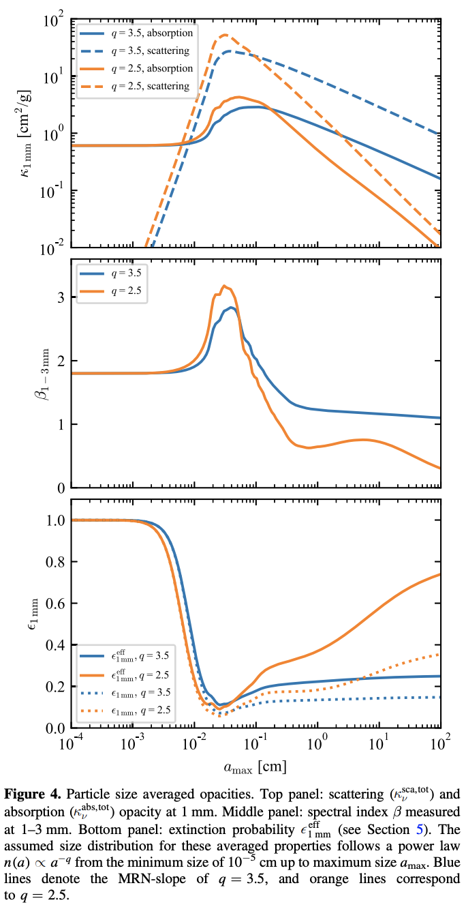

.. _Analysis:

Analysis
===========

For technical information on the models we employed in this research, please see the page on `streaming instability <https://streaminginstability-yj14.readthedocs.io/en/latest/source/Streaming%20Instability.html>`_.

Outlined below is the procedure the `shearing_box <https://streaminginstability-yj14.readthedocs.io/en/latest/autoapi/StreamingInstability_YJ14/shearing_box/index.html#StreamingInstability_YJ14.shearing_box.shearing_box>`_ class executes upon initilization. 

.. figure:: _static/3d_cube.png
    :align: center
|

1) Shearing Box
-----------

We first define the size to the density cube in terms of the gas scale height, H, which we have defaulted to 5 AU. In scale units, the shearing box has dimensions of 1.6 H along each axis, thus making the length :math:`\approx 1.2 \times 10^{14} \ \text{cm}`. The controllable parameters includes the temperature of the disk, :math:`T`, which we have assumed to be isothermal, as well as the column density of the gas, :math:`\Sigma_g`, and the frequency-dependent dust opacity coefficient, :math:`\kappa_\nu`; also in cgs units. We parameterize the column density, in code units, as follows: 

.. math::
    \Sigma_{unit} = \frac{\Sigma_g}{2\pi},

where the quotient over :math:`2\pi` is used to account for the circular nature of the disk in its entirety. As H is the unit length, we can then define the unit of mass as

.. math::
    m_{unit} = \Sigma_{unit} \times H^2.

In terms of code units, the entire mass inside the box can be calculated by integrating the dust density over the entire box,

.. math::
    m_{box} = \int_{0}^{L_x} \int_{0}^{L_y} \int_{0}^{L_z} \rho_d \ \text{dxdydz}.

The mass of the box, in cgs units, can then be expressed as

.. math::
    m = m_{box} \times m_{unit}.

By parameterizing the above shearing-box quantities, we can calculate the optical depth along the outgoing axis, and thus the mass excess. The optical depth along each grid cell, moving up the z-axis, is computed by first defining the dust surface density at each cell,

.. math::
    \Sigma_{\text{surface}} = \int_{0}^{Lz} \rho_{d_{xy}} \ \Sigma_{unit} \  \text{dz},

where :math:`L_z` is the length of the box along the z-axis, and :math:`\rho_{d_{xy}}` is the dust density at the given x,y coordinate. 

2) Radiative Transfer
-----------

The optical depth at the corresponding coordinate can then expressed as

.. math::
    \tau_{xy} = \Sigma_{\text{surface}} \ \kappa_\nu.

We calculate the optical depth along each x,y column, and combine the output to form the optical depth at the x,y exit plane (:math:`z = L_z`). Calculating the mass excess from this requires only the designation of the wavelength frequency, :math:`\nu`. Combined with the pre-defined temperature of the disk, :math:`T`, we can then calculate the intensity of outgoing flux using the Planck function for blackbody radiation, :math:`B_{\nu,T}`

.. math::
    B_{\nu,T} = \frac{2h\nu^3}{c^2} \ \frac{1}{e^\frac{h\nu}{k_BT} - 1}.

This source function is constant if an isothermal disk is assumed, in which only glowing gas and dust is observed. In conjunction with the effective emissivity, :math:`j_\nu^{\rm eff} \equiv \kappa_\nu B_\nu + \sigma_\nu J_\nu`, yields the following expression for the effective source function,

.. math::
        S_\nu^{\rm eff} \equiv \frac{\kappa_\nu B_\nu + \sigma_\nu J_\nu}{\kappa_\nu + \sigma_\nu},

in which :math:`J_\nu` is the zeroth moment directional average of the intensity, :math:`I_\nu`, within a solid angle, :math:`\Omega`, of the given ray, 

.. math::
        J_\nu = \frac{\oint I_\nu d\Omega}{\oint d\Omega}.

By defining the single scattering albedo as the ratio between the scattering and the absorption coefficients, :math:`\omega_\nu \equiv \frac{\sigma_\nu}{\left(\kappa_\nu + \sigma_\nu\right)}`, :math:`S_\nu^{\rm eff}` can be expressed as,

.. math::
        S_\nu^{\rm eff} = \omega_\nu J_\nu + \left(1 - \omega_\nu\right) B_\nu.

To compute the effective source function we used the analytical solution by Miyake et al. (1993), an approximation applicable under the condition of constant disk temperature and the assumption that there are no incoming radiation fields at either the upper or lower disk surfaces,

.. math::
        \frac{J_\nu\left(\tau_d\right)}{B_\nu\left(T\right)} = 1 - \frac{e^{-\sqrt{3\epsilon}\tau} + e^{\sqrt{3\epsilon}\left(\tau - \tau_d\right)}}{e^{-\sqrt{3\epsilon}\tau_d}\left(1 - \sqrt{\epsilon}\right) + \left( \sqrt{\epsilon} + 1 \right) },

where :math:`\epsilon = \left(1 - \omega_\nu\right)`. The optical depth at the surface of the disk is set to :math:`\tau=0`, with :math:`\tau_d=\frac{2\cos(\theta)}{3}` representing the specific depth according to the Eddington-Barbier relation, which describes how the emerging intensity is equal to the source function at that particular depth. In this relation, :math:`\cos(\theta)` is the cosine of the angle between the slanted rays and the z-direction. For the slab solution with scattering, the rays originate from the direction of :math:`\cos(\theta) = \frac{1}{\sqrt{3}}` for all inclinations.

In the context of this work which focuses on the effects of optically thick regions, it is especially important to include dust scattering as it has the effect of reducing the emitted emission in the disk regions where :math:`\tau_{\nu} \gg 1`, and is dominated by the largest grain sizes at a given stellocentric distance. The general solution to the radiative transfer equation is thus solved as

.. math::
    I_\nu(\tau_\nu) = I_\nu(0)e^{-\tau_\nu} + \int_{0}^{\tau_\nu} S_\nu^{\rm eff}(t_\nu)e^{-(\tau_\nu - t_\nu)} dt_\nu,

The first term in the solution represents the attenuated emission, while the second term accounts for the contribution from the emission of gas parcels along the entire column. The emission term incorporates two optical depths: :math:`\tau_\nu` corresponds to the optical depth of the entire column, and :math:`t_\nu` captures the attenuation of the emission as it propagates through the column length, :math:`L_z`,

.. math::
    \tau_\nu = \int_{0}^{L_z} \kappa_\nu^{\rm eff} \rho_g \ dz,

.. math::
    t_\nu = \int_{0}^{z} \kappa_\nu^{\rm eff} \rho_g dz.

We integrate the entire vertical disk, and as there is no back illumination and the effective source function is independent of the optical depth, the general equation for radiative transfer simplifies to

.. math::
    I_\nu(\tau_\nu) = S_\nu^{\rm eff} \left(1 - e^{-\tau_\nu}\right).

In this context, :math:`\tau` is a two-dimensional plane and therefore so is :math:`I_\nu`, these maps contain the output at each (x,y) coordinate as we integrate along each column in the z-direction. Therefore the mean value of the entire plane is calculated to represent a single pixel as would be measured by an observer. 

In the case of optically thin emission where :math:`\tau_\nu \ll 1`, the emergent intensity scales linearly with the dust surface density, allowing us to analytically solve for the observed mass as outlined in the following section. 

The dust emission in protoplanetary disks depends on the temperature and optical depth, with the latter determined by the product of the projected surface density and the opacity. As per Mie theory, grains interact most strongly with radiation at wavelengths comparable to their size, and thus under the assumption of optically thin emission, the observed flux scales with the column density of the dust, allowing us to analytically solve for :math:`\Sigma_d` as

.. math::
    \Sigma_d = \frac{I_{\nu\mu}}{B_{\nu,T} \ \kappa_\nu}.

Finally, the assumed mass, as calculated according to the observed :math:`F_\mu` and thus the implied :math:`\Sigma_d`, is quantified by multiplying by the area of the :math:`x,y` exit plane,

.. math::
    m_{\text{obs}} = \Sigma_d L_x L_y,
 
where :math:`L_x` and :math:`L_y` are the lengths of the box along the :math:`x` and :math:`y` axis, respectively. This quantity is then divided by the actual mass of the box, as defined by Equation 4, to approximate the mass excess, :math:`m_{excess}`,

.. math::
    m_{excess} = \frac{m}{m_{\text{obs}}}.

This mass excess represents the mass hidden in optically thick regions, mass that is not accounted for during observations as the flux is undercalculated under the optically thin assumption.

3) Opacities
-----------

We extracted the mm-wave opacity using `DSHARP <https://github.com/birnstiel/dsharp_opac>`_, presented by `Birnstiel et al 2018 <https://iopscience.iop.org/article/10.3847/2041-8213/aaf743/pdf>`_. Figure 4 from their study is displayed below, which presents the particle size average opacities:

    Figure 5: Figure 4 from Birnstiel et al (2018). We extrapolated the mm-wave absorption and scattering opacities (top panel), in order to calculate the opacity as a function of our simulation grain size.

Using grain distribution power law index of q=2.5, we extrapolated the mm-wave absorption and scattering opacity functions. The streaming instability simulation used a Stoke's number of 0.314, and given the following relation we can solve for the grain size at a specific gas column density,

.. math::
    st = \frac{\pi}{2} \frac{a_\bullet\rho_\bullet}{\Sigma_g},

.. math::
    a_\bullet = \frac{2st}{\pi} \frac{\Sigma_g}{\rho_\bullet}

where :math:`a_\bullet` and :math:`\rho_\bullet` are the grain size and internal grain density. From the computed :math:`a_\bullet` an opacity from Birnstiel et al (2018) Figure 4 was extacted.

We noted that when using these opacities, the mass excess saturated. This was in part due to the inverse relation between opacity and :math:`\Sigma_d`, since 

.. math::
    \tau = \kappa_\nu \Sigma_d.

When calculating the mass excess, the observed mass is calculated assuming the dust is optically thin, therefore the intensity scales with the optical depth, and thus the dust surface density, :math:`\Sigma_d`:

.. math::
    I_\nu = B_\nu \tau = B_\nu \kappa_\nu \Sigma_d 
.. math::
    \Sigma_d = \frac{I_\nu}{B_\nu \kappa_\nu}.

Since the mass excess is the ratio of observed mass to actual mass inside the box, :math:`\Sigma_d` cancels as per the inverse relation with :math:`\kappa_\nu`:

.. math::
    m_{excess} = \Sigma_d \frac{B_\nu \kappa_\nu}{I_\nu} 
.. math::
    m_{excess} = \cancel{\Sigma_d} \frac{B_\nu}{I_\nu} \frac{1}{\cancel{\Sigma_d}}

