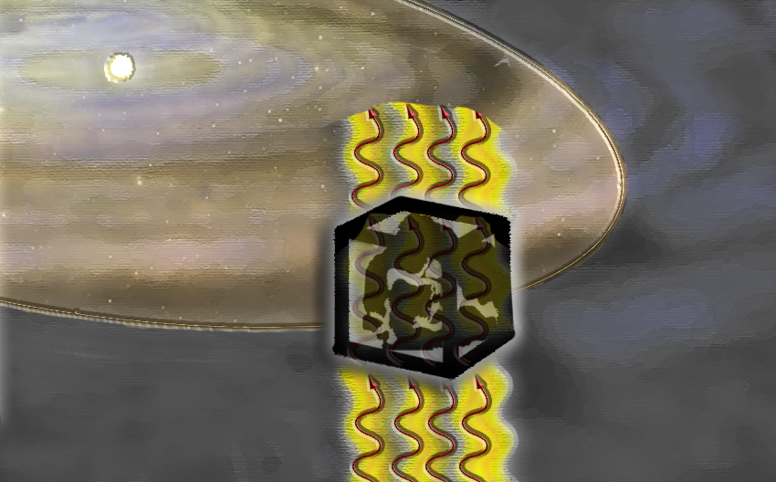
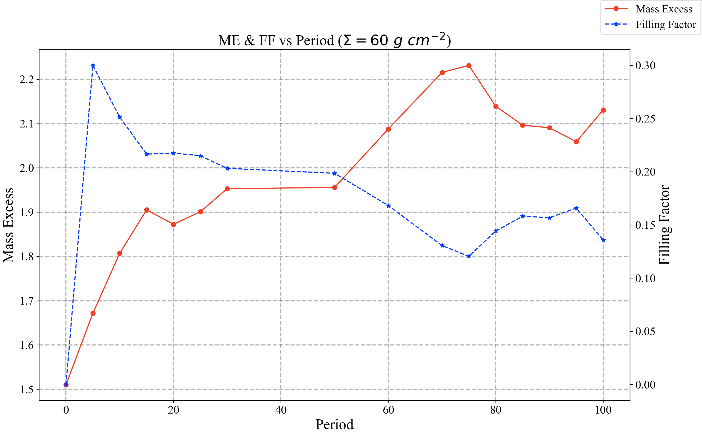
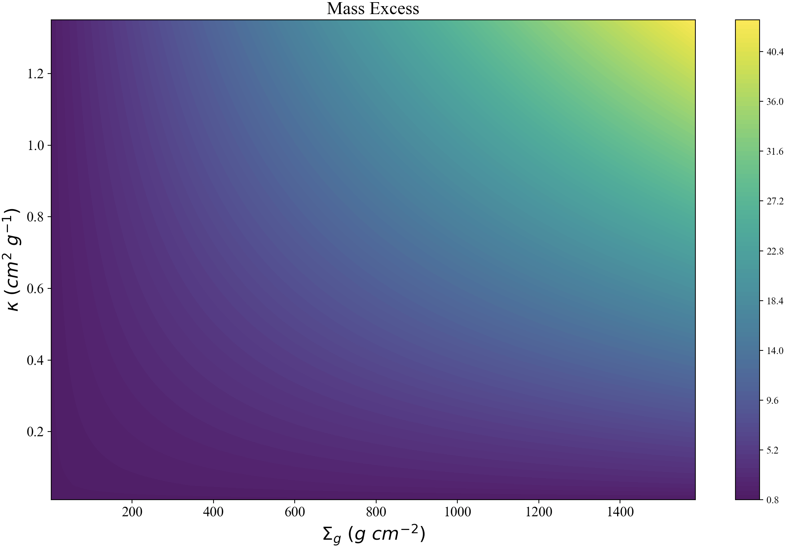
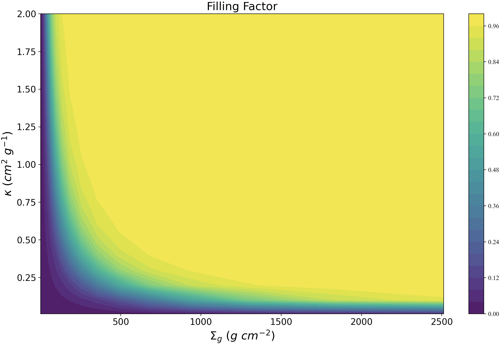
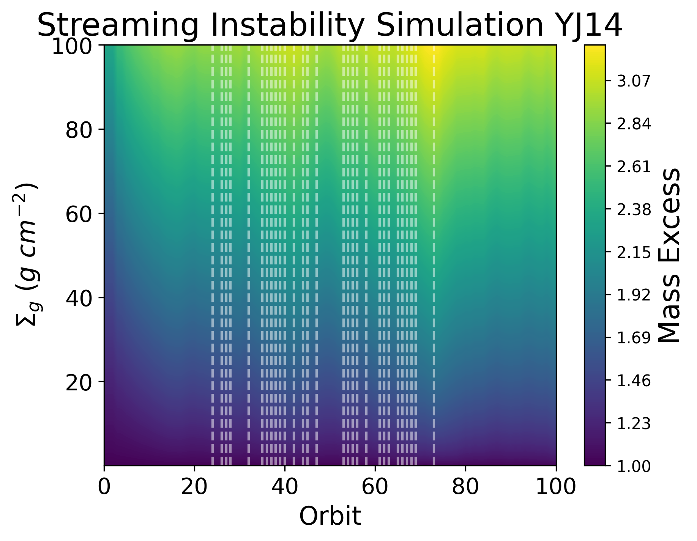

.. _Analysis:

Analysis
===========

For technical information on the model we employed in this research, please see the page on `streaming instability <https://streaminginstability-yj14.readthedocs.io/en/latest/source/Streaming%20Instability.html>`_.

Outlined below is the procedure the `shearing_box <https://streaminginstability-yj14.readthedocs.io/en/latest/autoapi/StreamingInstability_YJ14/shearing_box/index.html#StreamingInstability_YJ14.shearing_box.shearing_box>`_ class executes upon initilization. 

|

1) Shearing Box
-----------

We first define the size to the density cube in terms of the scale height, H, which we have defauled to 5 AU. In scale units, the shearing box has dimensions of 1.6 H along each axis, thus making the length :math:`\approx 1.2 \times 10^{14} \ \text{cm}`. The controllable parameters includes the temperature of the disk, :math:`T`, which we have assumed to be isothermal, as well as the column density of the gas, :math:`\Sigma_g`, and the frequency-dependent dust opacity coefficient, :math:`\kappa_\nu`; also in cgs units. We parameterize the column density, in code units, as follows: 

.. math::
    \Sigma_{unit} = \frac{\Sigma_g}{2\pi},

where the quotient over :math:`2\pi` is used to account for the circular nature of the disk in its entirety. As H is the unit length, we can then define the unit of mass as

.. math::
    m_{unit} = \Sigma_{unit} \times H^2.

In terms of code units, the entire mass inside the box can be calculated by integrating the dust density over the entire box,

.. math::
    m_{box} = \int_{0}^{L_x} \int_{0}^{L_y} \int_{0}^{L_z} \rho_d \ \text{dxdydz}.

The mass of the box, in cgs units, can then be expressed as

.. math::
    m = m_{box} \times m_{unit}.

By parameterizing the above shearing-box quantities, we can calculate the optical depth along the outgoing axis, and thus the mass excess. The optical depth along each grid cell, moving up the z-axis, is computed by first defining the dust surface density at each cell,

.. math::
    \Sigma_{\text{surface}} = \int_{0}^{Lz} \rho_{d_{xy}} \ \Sigma_{unit} \  \text{dz},

where :math:`L_z` is the length of the box along the z-axis, and :math:`\rho_{d_{xy}}` is the dust density at the given x,y coordinate. The optical depth at the corresponding coordinate can then expressed as

.. math::
    \tau_{xy} = \Sigma_{\text{surface}} \ \kappa_\nu.

We calculate the optical depth along each x,y column, and combine the output to form the optical depth at the x,y exit plane (:math:`z = L_z`). Calculating the mass excess from this requires only the designation of the wavelength frequency, :math:`\nu`. Combined with the pre-defined temperature of the disk, :math:`T`, we can then calculate the intensity of outgoing flux using the Planck function for blackbody radiation, :math:`B_{\nu,T}`

.. math::
    B_{\nu,T} = \frac{2h\nu^3}{c^2} \ \frac{1}{e^\frac{h\nu}{k_BT} - 1}.

This constant source function is an approximation in the isothermal disk assumption, in which only glowing gas and dust is observed. The intensity leaving the x,y exit plane, in the case of a constant source function, is given by

.. math::
    I_\nu = B_{\nu,T} \ (1 - e^{-\tau_{xy}}).

As :math:`\tau_{xy}` is a two-dimensional plane, this flux parameter contains the output at each coordinate, therefore the mean value of the entire plane is calculated to represent a single pixel as would be measured by an observer. This mean intensity, :math:`I_{\nu\mu}`, is then used to approximate the surface density of the dust, :math:`\Sigma_d` under the optically thin assumption:

.. math::
    \Sigma_d = \frac{I_{\nu\mu}}{B_{\nu,T} \ \kappa_\nu}.

Finally, the assumed mass, as calculated according to the observed :math:`F_\mu` and thus the implied :math:`\Sigma_d`, is quantified by multiplying by the area of the :math:`x,y` exit plane,

.. math::
    m_{\text{obs}} = \Sigma_d L_x L_y,
 
where :math:`L_x` and :math:`L_y` are the lengths of the box along the :math:`x` and :math:`y` axis, respectively. This quantity is then divided by the actual mass of the box, as defined by Equation 4, to approximate the mass excess, :math:`m_{excess}`,

.. math::
    m_{excess} = \frac{m}{m_{\text{obs}}}.

This mass excess represents the mass hidden in optically thick regions, mass that is not accounted for during observations as the flux is undercalculated under the optically thin assumption.

We first explored what the mass excess would when observing an isothermal disk with :math:`T=30` K and :math:`\Sigma_g = 60 \ g \ \text{cm}^{-2}`. We assume mm-wave emission, with a corresponding frequency of ~230GHz, and dust opacity coefficient of :math:`\kappa_\nu` = 1. The mass excess as a function of period is displayed in Figure 1.

At period 0, before the streaming instabilities begin and the dust settles to the midplane, the box is one of constant density, and at this point the mass excess is approximate 1.5. The streaming instability in effect increases the optical depth in filamentary regions, in turn reducing the filling factor as more and more material is concentrated locally. As this occurs, orbit after orbit, the mass excess increases until reaching a mass excess of ~2 toward the end of the simulation. 

    Figure 1: Mass Excess as a function of period. Gas column density, :math:`\Sigma_g` = 60 :math:`g \ cm^{-2}`.

A heatmap of the mass excess metric, at the final period (P = 100) is shown in Figure 3, with the accompanying filling factor displayed in Figure 4:

    Figure 3: Mass Excess as a function of opacity and gas column density.

    Figure 4: Filling Factor as a function of opacity and gas column density.

2) Opacity
-----------

We extracted the mm-wave opacity using `DSHARP <https://github.com/birnstiel/dsharp_opac>`_, presented by `Birnstiel et al 2018 <https://iopscience.iop.org/article/10.3847/2041-8213/aaf743/pdf>`_. Figure 4 from their study is displayed below, which presents the particle size average opacities:

    Figure 5: Figure 4 from Birstiel et al (2018). We extrapolated the mm-wave absorption and scattering opacities (top panel), in order to calculate the opacity as a function of our simulation grain size.

Using q=2.5, we extrapolated the mm-wave absorption and scattering opacity functions. The streaming instability simulation employed a Stoke's number of 0.3, and given the following relation we can solve for the grain size at a specific gas column density,

.. math::
    st = \frac{\pi}{2} \frac{a_g\rho_g}{\Sigma_g},

.. math::
    a_g = \frac{2st}{\pi} \frac{\Sigma_g}{\rho_g}

where :math:`\a_g` and :math:`\rho_g` are the grain size and internal grain density. From the computed :math:`\a_g` an opacity from Birstiel et al (2018) Figure 4 was calculated, although we noted that when using these opacities, the mass excess saturated. This was in part due to the inverse relation between opacity and :math:`\Sigma_g`, since 

.. math::
    \tau = \kappa \Sigma_d.

When calculating the mass excess, the observed mass is calculated assuming the dust is optically thin, therefore the intensity scales as

.. math::
    \I = \B_\nu \tau = \B_\nu \kappa \Sigma_d 

.. math::
    \Sigma_d = \frac{I}{\B_\nu \kappa}

Since the mass excess is the ratio of observed mass to actual mass inside the box, :math:`\Sigma_d` cancels as per the inverse relation with :math:`\kappa`:

.. math::
    \ME = \Sigma_d \frac{\B_\nu \kappa}{I} = \Sigma_d \frac{\B_\nu}{I} \frac{1}{\Sigma_d}

For this reason we chose an opacity of :math:`\kappa_\nu`=1 for our analysis, as this is a common mm-wave opacity, which yielded the following mass excess as a function of :math:`\Sigma_g` and orbit:

    Figure 6: Mass Excess as a function of gas column density and orbit. The white vertical lines correspond to missing orbits from the YJ14 streaming instability archival simulation.

