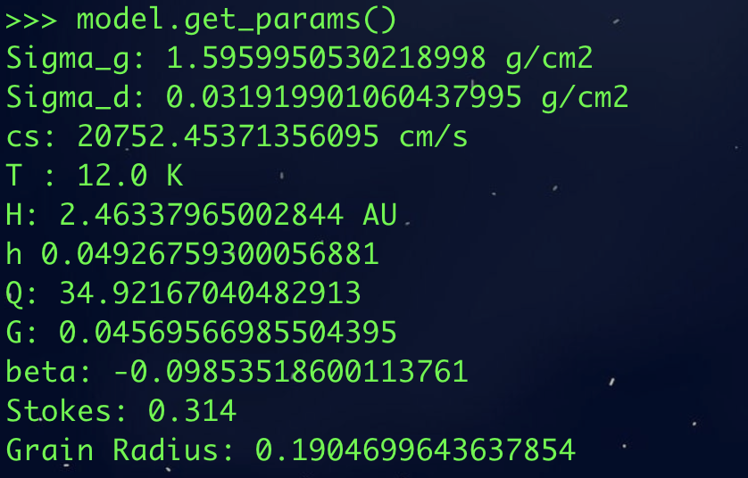
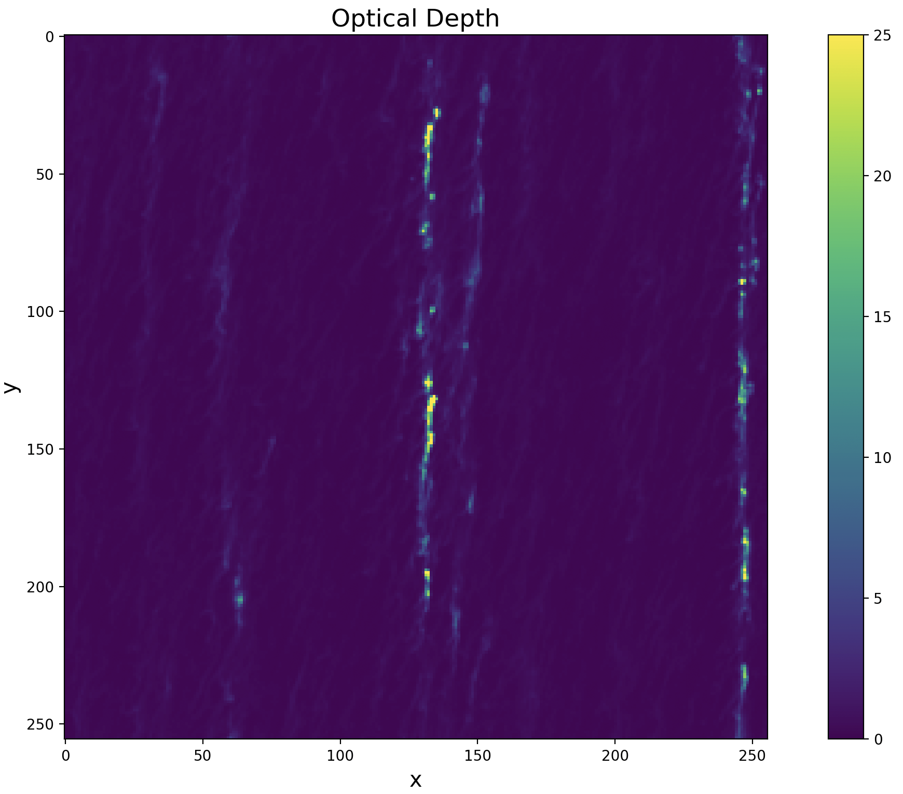
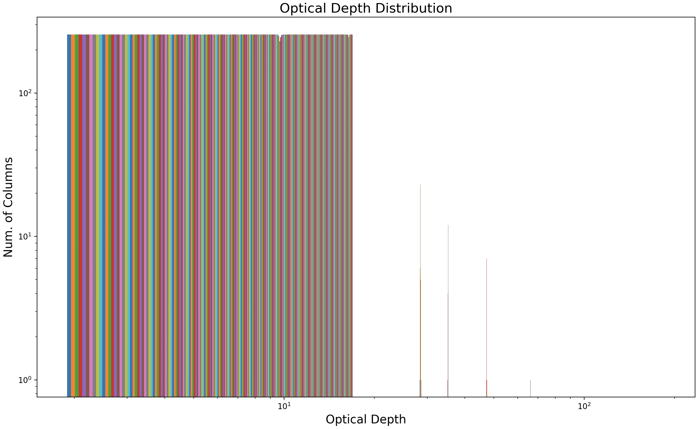
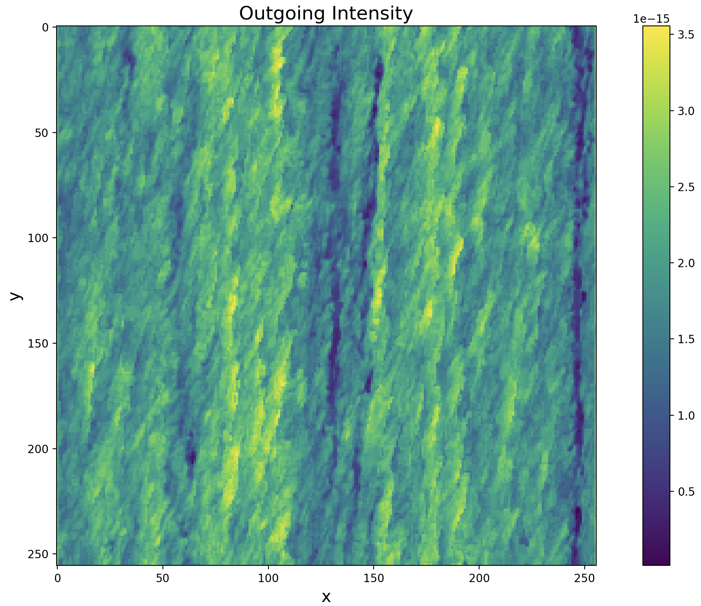
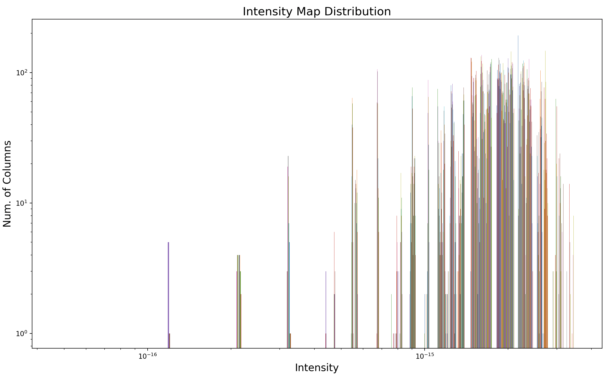

.. _Analysis:

Test Run
===========

1) Model Parameters
-----------

For this test the monodisperse streaming instability simulation from CY14 was used (no self-gravity), employing the snapshot at the 100th orbit. The simulation and disk model are parameters are defined as follows:

.. code-block:: python

    M_star, M_disk = const.M_sun.cgs.value, 0.02 * const.M_sun.cgs.value # Mass of the star and disk [g]

    r, r_c = 50 * const.au.cgs.value, 300 * const.au.cgs.value # Radii which to model, and the characteristic radius of the disk [cm]

    grain_rho = 1.675 # Internal dust grain density of the dust model we use (from DSHARP)
    stoke = 0.314 # Stokes number of the grain (from simulation)
    Z = 0.02 # Dust to gas ratio (from simulation)
    q = 1.0 # Temperature power law index (set to 1 for constant aspect ratio)
    T0 = 600 # Temperature at r = 1 au 

    code_omega = code_cs = code_rho = 1 # Code units (from start.in file)

    model = disk_model.Model(r, r_c, M_star, M_disk, grain_rho=grain_rho, Z=Z, stoke=stoke, q=q, T0=T0)

    Figure 1: Disk parameters used for this test run, as defined at r=50 au.

2) Shearing Box
-----------

The domain is defined according to the :math:`axis` of the simulation, and the dust density :math:`data`,

.. math::
    L_x = L_y = L_z = abs(axis[0] - axis[-1]) \times H \ [\rm cm]

.. math::
    \rm area = L_x \times L_y \ [\rm cm^2]

.. math::
    dx = dy = dz = diff(axis)[0] \ [\rm code \ \rm units]

.. math::
    N_x = N_y = N_z = len(axis) 

.. math::
    \rm box \ \rm mass \ \rm codeunits = sum(data) \times dx \times dy \times dz \ [\rm code \ \rm units]

.. math::
    \rm unit_mass = \rm column \ \rm density \times H^2) / \sqrt{2\pi} / (\rm code \ \rm rho \times (\rm code \ \rm cs / \rm code \ \rm omega)^3 \ [\rm g]

.. math:: 
    \rm mass = \rm box \ \rm mass \ \rm codeunits * \rm unit \ \rm mass 

.. math::
    \rm unit \ \rm mass = \rm column \ \rm density / \sqrt{2\pi} / (\rm code \ \rm rho * (\rm code \ \rm cs / \rm code \ \rm omega))

Where unit_sigma will be used to convert the dust surface density to cgs units, when integrating the RT solution and when calculating the optical depth.

2) Optical Depth
-----------

First the optical depth map is computed using the absorption and scattering opacity coefficients for the corresponding grain size at this distance (r=50 au; a=0.19 cm). From the DSHARP project these opacities are set as

.. math::
    \kappa = 2.416 \ [\rm g / \rm cm^2]

.. math::
    \sigma = 11.636 \ [\rm g / \rm cm^2]

The optical depth is calculated by integrating the surface density, after which the filling factor is defined as the number of optically thick cells (tau > 1) divided by the total number of columns, :math:`N_x \times N_y`

.. code-block:: python

    for i in range(Nx):
        for j in range(Ny):

            surface_density = trapz(data[:, j, i]) * dz * unit_sigma # Multiplying by unit_sigma converts this to cgs
            tau[j, i] = surface_density * (kappa + sigma)

    filling_factor = len(where(tau >= 1)) / (Nx * Ny)

The optical depth map for this test is shown below, and is characterized by a minimum of 0.0115, a maximum of 187.783, and a mean of 0.448. The filling factor is 0.05

    Figure 2: Optical depth map for this test run, as defined at r=50 au and computed using the DSHARP opacities for this particular grain size (a=0.19 [cm]).

2) Scattering Solution
-----------

We utilize the scattering solution of a thin slab as approximated by Miyake & Nakagawa (1993), which has been used to compute the emergent intensity of protoplanetary disks including scattering. This is applicable under the assumption that the disk temperature is constant and that there are no incoming radiation fields at either the upper or lower disk surfaces.

Using the extracted opacities, the albedo, :math:`\omega_\nu`, for this test run is first calculated as

.. math::
    \omega_\nu = \sigma / (\kappa + \sigma) = 0.828

This high albedo is a result of the high scattering coefficient for the corresponding grain size (:math:`\sigma = 11.636 \ [\rm g / \rm cm^2]`). Our implementation of the scattering solution follows the same format as Zhu. et al (2019) -- Section 2.1 (https://iopscience.iop.org/article/10.3847/2041-8213/ab1f8c/pdf).

.. code-block:: python

    epsilon = 1.0 - albedo # For convenience 
    mu = 1.0 / sqrt(3.0) # The rays originate from the direction of cos(θ) = 1/sqrt(3) for all inclinations -- where θ is the angle between the intensity and the vertical direction
    tau_d = (2 * mu) / 3.0 # Total optical depth in the vertical direction? Or is this the specific depth according to the Eddington-Barbier relation?
    tau_ = 0.0 # Variable optical depth in the vertical direction? Or is this the optical depth at the surface of the slab, which is 0?

    # Same format as Eq. 8 of Zhu et al. (2019)
    numerator = exp(-sqrt(3 * epsilon) * tau_) + exp(sqrt(3 * epsilon) * (tau_ - tau_d))
    denominator = (exp(-sqrt(3 * epsilon) * tau_d) * (1 - sqrt(epsilon))) + (sqrt(epsilon) + 1)
    J = B_nu * (1 - (numerator / denominator))

where :math:`J_\nu` as solved above is the directional average of the intensity, and in this case takes a value of :math:`J_\nu = 9.25 \times 10^{-15}`. The blackbody radiation of the disk, :math:`B_\nu`, is calculated at the frequency of 1 mm (:math:`3 \ times 10^{11}` [Hz]),

.. math::
    B_\nu = 1.716 \times 10^{-13}

This allows us to calculate the effective source function, :math:`S_\nu^{\rm eff}`,

.. math::
        S_\nu^{\rm eff} = \omega_\nu J_\nu + \left(1 - \omega_\nu\right) B_\nu = 3.7 \times 10^{-14}.

This effective source function is then used to solve the general RT equation.

3) Radiative Transfer
-----------

The general solution to the radiative transfer equation is solved as

.. math::
    I_\nu(\tau_\nu) = I_\nu(0)e^{-\tau_\nu} + \int_{0}^{\tau_\nu} S_\nu^{\rm eff}(t_\nu)e^{-(\tau_\nu - t_\nu)} dt_\nu,

The first term in the solution represents the attenuated emission, while the second term accounts for the contribution from the emission of gas parcels along the entire column. The emission term incorporates two optical depths: :math:`\tau_\nu` corresponds to the optical depth of the entire column, and :math:`t_\nu` captures the attenuation of the emission as it propagates through the column length, :math:`L_z`,

.. math::
    \tau_\nu = \int_{0}^{L_z} \kappa_\nu^{\rm eff} \rho_g \ dz,

.. math::
    t_\nu = \int_{0}^{z} \kappa_\nu^{\rm eff} \rho_g dz.

In this test run with a monodisperse simulation, both the albedo and the effective source function are single values. To numerically integrate the RT equation, 3-dimensional arrays are defined which contain these single values at each cell. This is also done for the opacity coefficients. We then integrate as follows

.. code-block:: python

    for i in range(Nx):
        for j in range(Ny):

            rhod = data[:, j, i] # The dust density in a particular column [code units]
            bb = src_fn[:, j, i] # The effective source function in a particular column (all the same values in this case)
            kappa = effective_kappa[:, j, i] # The absorption opacities in a particular column (all the same values in this case)
            sigma = effective_sigma[:, j, i] # The scattering opacities in a particular column (all the same values in this case)
            
            # Mask where the particle density is zero along the column
            mask = (rhod == 0)

            # If density is zero then the effective source function and opacities should be zero as well
            bb[mask], kappa[mask], sigma[mask] = 0, 0, 0 

            # This is the optical depth as the emission progresses up the column (0 to z integral)
            t = calc_t(rhod, kappa, sigma) 
        
            # Integrate to compute the output intensity at a given (x,y) position
            intensity[j, i] = trapz(bb * exp(-(tau[j, i] - t)), x=axis, dx=dx)

where the optical depth as the emission progresses along the column (:math:`t_\nu`) is computed in the loop as

.. code-block:: python

    t = zeros(Nz) # To store the emission along the z-column

    # Integrate starting at the first cell of the column and move upward adding one cell at a time
    for i in range(Nz):  
        t[i] = trapz(rhod[:i] * (effective_kappa[:i] + effective_sigma[:i])) * dz * unit_sigma

The intensity map for this test is shown below, and is characterized by a minimum of :math:`1.2 \times 10^{-17}`, a maximum of :math:`3.55 \times 10^{-15}`, and a mean of :math:`1.94 \times 10^{-15}`.

    Figure 2: Outgoing intensity map for this test run, as defined at r=50 au and computed using the DSHARP opacities for this particular grain size (a=0.19 [cm]).

4) Mass Excess
-----------

The dust emission in protoplanetary disks depends on the temperature and optical depth, with the latter determined by the product of the projected surface density and the opacity. As per Mie theory, grains interact most strongly with radiation at wavelengths comparable to their size, and thus under the assumption of optically thin emission, the observed flux scales with the column density of the dust, allowing us to analytically solve for :math:`\Sigma_d` as

.. math::
    \Sigma_d = \frac{I_{\nu}}{B_{\nu} \ \kappa_\nu}.

To compute the column density of the dust we utilize convolution theory and take the mean of the output intensity as well as the mean of the effective source function. 

.. math::
    \Sigma_d = mean(\rm intensity) / (mean(S_\nu^{\rm eff}) * (\rm kappa + \rm sigma)) = 0.09477

**NOTE**: the effective source function is a 3D array as was required to integrate the RT equation, but it only contains two unique values, 0 and :math:`S_\nu^{\rm eff}`. The cells with zeros are those where there is are no dust grains, therefore by taking the mean I am skewing this away from its true value! This makes sense in the context of polydisperse simulations in which the albedo and hence :math:`S_\nu^{\rm eff}` is unique across the entire domain, but for monodisperse is the mean value the correct way to interpret this?

Finally, the observed mass of the box can now be quantified as the product of the dust column density and the domain area, after which the mass excess can be computed as the ratio of true box mass to the observed mass

.. math::
    \rm observed \ \rm mass = \Sigma_d \times \rm area  

.. math::
    \rm mass \ \rm excess = \rm mass \times \rm observed \ \rm mass

4) Results
-----------

**Given a domain area of :math:`3.449 \times 10^{27}` [cm2] and a total mass of :math:`1.1 \times 10^{26}` [g], this mass excess value is 0.33945, which implies that we are observing MORE 1mm flux density than the disk emits.** 

If instead I compute :math:`\Sigma_d` by taking the effective source function value from the scattering solution (instead of the mean), I get:

.. math::
    \Sigma_d = mean(\rm intensity) / (unique(S_\nu^{\rm eff})[1] * (\rm kappa + \rm sigma)) = 0.00372

.. math::
    \rm observed \ \rm mass = 0.00372 * 3.449 \times 10^{27} = 1.283 \times 10^{25} \ [\rm g]

.. math::
    \rm mass \ \rm excess = 1.1 \times 10^{26} / 1.283 \times 10^{25} = 8.648
