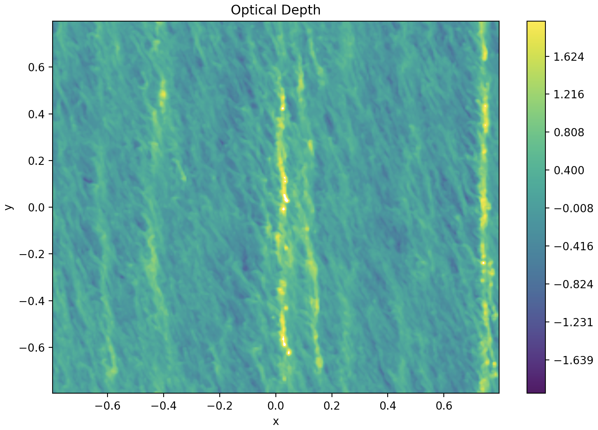

.. _Streaming_Instability:

Streaming Instability
===========

    Figure 1: Optical depth map, displaying 5 distinct high density filamentary structures. 

.. only:: html

   .. figure:: _static/me_T10.gif

      Figure 2: Mass excess heatmap, T = 10 K. Figures available `here <https://github.com/Professor-G/jekyll-slideshow/blob/gh-pages/_slides/my-pics2.md>`_.

.. only:: html

   .. figure:: _static/me_T30.gif

      Figure 3: Mass excess heatmap, T = 30 K. Figures `available here <https://github.com/Professor-G/jekyll-slideshow/blob/gh-pages/_slides/my-pics3.md>`_.

.. only:: html

   .. figure:: _static/me_T50.gif

      Figure 4: Mass excess heatmap, T = 50 K. `Figures available here <https://github.com/Professor-G/jekyll-slideshow/blob/gh-pages/_slides/my-pics4.md>`_.

