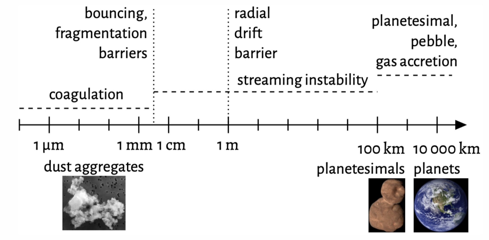
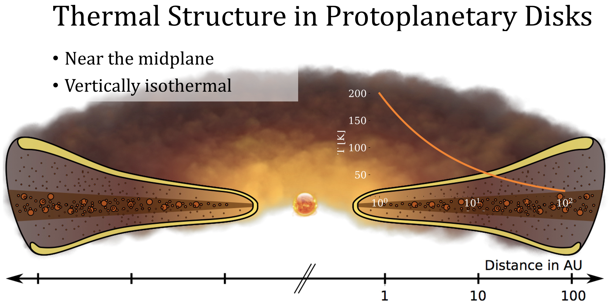
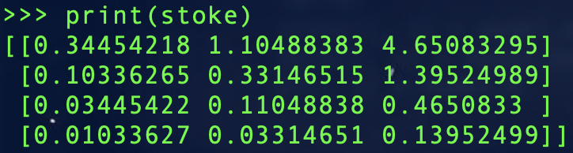

.. _Streaming_Instability:

Streaming Instability
===========

The streaming instability is an efficient mechanism for forming planetesimals out of small (mm-cm) sized dust grains, and has been used to explain how planetesimal growth can overcome bouncing/fragmentation barriers as well as the radial drift barrier.

    Figure 1: The barriers to planetesimal growth which the streaming instability can overcome.

The strong clumping that arises from the streaming instability is caused by the differential motion in the azimuthal direction between the dust and the gas. While the dust grains move at keplerian speeds, the gas is supported by pressure and in turn moves slower. The figure below demonstrates this dynamic, in which the gas headwind felt by the dust results in drag, reducing the angular momentum and energy of the dust and causing it to drift inward dragging the gas along with it (step 1). As the gas is deflected by the Coriolis force (step 2), it pushes and accelerates dust grains which reduces the dust drift efficiency as this dust begins orbiting at super-Keplerian velocities (step 3). This has the effect of deflecting the dust outwards and in turn yields an dust clump overdensity which can quickly concentrate and grow to reach critical Roche densities (step 4). When this happens, the gravitational attraction of the pebble clump is enough to overcome the tidal shear of the disk and pebble accretion takes place.

    Figure 2: Illustration of the dust-gas aerodynamcis that give rise to the streaming instability. In a cylindrical shear flow with a radially decreasing pressure gradient, gas and dust exhibit differential rotational speeds, orbiting at sub-Keplerian and Keplerian speeds, respectively. The interaction between gas and dust, particularly the backreaction of dust on gas, influences the angular momentum of solids, leading to the concentration of particles and the potential formation of self-gravitating clumps that eventually give rise to planetesimals.

Disk Model 
===========

While scale-free shearing boxes can be placed at any astrocentric distance, proper unit conversion requires us to define the gas column density and temperature in physical units first. To extract what these parameters are at the location of the box, a disk model must be constructed first. In our streaming instability simulations, the dust grains settle to the midplane within the first few orbits, as such we define 1-dimensional disk profiles at the midplane only. For example, a common temperature profile of the disk midplane looks as follows:

    Figure 3: Illustration a protoplanetary disk and its corresponding temperature profile. The largest grains (mm-cm) settle to the midplane, which is why ALMA's mm-wave measurements can probe the midplane. This is an example of a flared disk, as the gas scale height increases with distance. 

The `disk_model <https://streaminginstability-yj14.readthedocs.io/en/latest/autoapi/StreamingInstability_YJ14/disk_model/index.html#StreamingInstability_YJ14.disk_model.Model>`_ class allows for easy disk modeling:

.. code-block:: python
   
   import numpy as np
   import astropy.constants as const
   from StreamingInstability_YJ14 import disk_model

   ## Disk models for the simulations with self-gravity (monodisperse) ###

   M_star = const.M_sun.cgs.value # Mast of the star 
   M_disk = 0.01*const.M_sun.cgs.value # Mass of the disk

   # Radius or radii at which to model, and the characteristic radius of the disk (in [au])
   r, r_c = np.arange(5,100.25,0.25), 300 
   r, r_c = r*const.au.cgs.value, r_c*const.au.cgs.value # Convert to cgs units 

   grain_rho = 1.675 # Internal dust grain density (from DSHARP)
   stoke = 0.314 # Stokes number of the grain
   Z = 0.02 # Dust to gas ratio

   # To have a constant pressure gradient throughout the disk the temperature profile must be modeled this way
   q = 1.0 # Temperature power law index
   T0 = 600 # Temperature at r = 1 au

   # Create the disk model
   model = disk_model.Model(r, r_c, M_star, M_disk, grain_rho=grain_rho, Z=Z, stoke=stoke, q=q, T0=T0)

The `get_params <https://streaminginstability-yj14.readthedocs.io/en/latest/_modules/StreamingInstability_YJ14/disk_model.html#Model.get_params>`_ class method will print the disk parameters, while the `plot <https://streaminginstability-yj14.readthedocs.io/en/latest/_modules/StreamingInstability_YJ14/disk_model.html#Model.plot>`_ method will output a visual of the following four profiles:

.. code-block:: python

   model.plot()

    Figure 4: Example of a protoplanetary disk model.

While the plot method allows for quick visualization, the disk model will in total calculate the following parameters: the Keplerian velocity, :math:`\Omega`, the dust and gas column densities, :math:`\Sigma_g` and :math:`\Sigma_d`, the temperature, T, the sound speed, :math:`c_s`, the gas scale height, H, and the corresponding aspect ratio, h. It will also calculate the pressure gradient parameter, :math:`\beta`, as well as the strength of the gravity which is characterized by the Toomre Q and :math:`\tilde{G}`
parameters. 

For this research we utilized a streaming instability simulation without self-gravity which is in turn scale free and can be placed anywhere in the disk, allowing us to quantify the mass underestimation as a function of both time and astrocentric distance, in addition to allowing for the exploration of parameter space, such as the effect different disk masses have on the analysis. 

On the contrary, the simulations we used that have self-gravity enabled are not scale free in that the strength of the self-gravity (:math:`\tilde{G}`) must be defined in the simulation run file, which in turn places the simulation at a particular location in the disk. The Stokes numbers of these four grains, in addition to the radius-dependent :math:`\beta` and :math:`\tilde{G}`, are determined as follows:

.. code-block:: python

    import numpy as  np 
    from StreamingInstability_YJ14 import disk_model
    import astropy.constants as const

    M_star = const.M_sun.cgs.value # Mass of the star in cgs units
    M_disk = 0.01675 * const.M_sun.cgs.value # Mass of the disk in cgs units

    r = [10, 30, 100] # The radii of the 3 simulations
    r = [radius * const.au.cgs.value for radius in r] # Convert to cgs units
    r_c = 300 * const.au.cgs.value # The characteristic radius of the disk (in [cgs])

    grain_rho = 1.675 # Internal dust grain density in cgs units (from DSHARP)
    Z = 0.03 # Dust to gas ratio
    q = 3/7. # Temperature power law index
    T0 = 150 # Temperature at r = 1 au

    # Four grain sizes in the simulations (polydisperse), in cgs units
    grain_sizes = np.array([1., 0.3, 0.1, 0.03]) 

    # To store the simulation parameters (4 rows, 3 columns)
    # The rows are the dust grains from largest to smallest
    # The columns are the increasing distances from the star

    stoke = np.zeros((len(grain_sizes), len(r)))
    beta = np.zeros((len(grain_sizes), len(r)))
    G = np.zeros((len(grain_sizes), len(r)))

    for i, radius in enumerate(r):
        for j, grain_size in enumerate(grain_sizes):
            model = disk_model.Model(radius, r_c, M_star, M_disk, grain_rho=grain_rho, grain_size=grain_size, Z=Z, stoke=None, q=q, T0=T0)
            stoke[j, i] = model.stoke
            beta[j, i] = model.beta
            G[j, i] = model.G

    Figure 5: The stokes numbers of the four grain sizes, at three different locations of the disk.

The disk models used in our paper were generated with the following code:

.. code-block:: python

   import numpy as  np 
   import matplotlib.pyplot as plt  
   import astropy.constants as const
   from StreamingInstability_YJ14 import disk_model

   ## Disk models for the simulations with self-gravity (monodisperse) ###

   M_star = const.M_sun.cgs.value # Mast of the star 
   r, r_c = np.arange(5,100.25,0.25), 300 # Radii which to model, and the characteristic radius of the disk (in [au])
   r, r_c = r*const.au.cgs.value, r_c*const.au.cgs.value # Convert to cgs units 

   grain_rho = 1.675 # Internal dust grain density (from DSHARP)
   stoke = 0.314 # Stokes number of the grain
   Z = 0.02 # Dust to gas ratio
   q = 1.0 # Temperature power law index
   T0 = 600 # Temperature at r = 1 au

   # Try different disk masses #

   M_disk = 0.01*const.M_sun.cgs.value
   model_1a = disk_model.Model(r, r_c, M_star, M_disk, grain_rho=grain_rho, Z=Z, stoke=stoke, q=q, T0=T0)

   M_disk = 0.03*const.M_sun.cgs.value
   model_1b = disk_model.Model(r, r_c, M_star, M_disk, grain_rho=grain_rho, Z=Z, stoke=stoke, q=q, T0=T0)

   M_disk = 0.05*const.M_sun.cgs.value
   model_1c = disk_model.Model(r, r_c, M_star, M_disk, grain_rho=grain_rho, Z=Z, stoke=stoke, q=q, T0=T0)

   M_disk = 0.1*const.M_sun.cgs.value
   model_1d = disk_model.Model(r, r_c, M_star, M_disk, grain_rho=grain_rho, Z=Z, stoke=stoke, q=q, T0=T0)

   ## Disk model for the simulations without self-gravity (polydisperse) ###

   grain_rho = 1.675 # Internal dust grain density (from DSHARP)
   Z = 0.03    # Dust to gas ratio
   q = 3/7. # Temperature power law index
   T0 = 150 # Temperature at r = 1 au

   # Only one disk mass used, but four grain sizes! #
   M_disk = 0.01675 * const.M_sun.cgs.value

   model_2a = disk_model.Model(r, r_c, M_star, M_disk, grain_rho=grain_rho, grain_size=1, Z=Z, stoke=None, q=q, T0=T0)
   model_2b = disk_model.Model(r, r_c, M_star, M_disk, grain_rho=grain_rho, grain_size=0.3, Z=Z, stoke=None, q=q, T0=T0)
   model_2c = disk_model.Model(r, r_c, M_star, M_disk, grain_rho=grain_rho, grain_size=0.1, Z=Z, stoke=None, q=q, T0=T0)
   model_2d = disk_model.Model(r, r_c, M_star, M_disk, grain_rho=grain_rho, grain_size=0.03, Z=Z, stoke=None, q=q, T0=T0)

   ### Plot ###

   fig, axes = plt.subplots(nrows=5, ncols=2, figsize=(14, 12.5), sharex=True)
   fig.suptitle("Protoplanetary Disk Models", x=0.51, y=0.975)

   (ax1, ax5), (ax2, ax6), (ax3, ax7), (ax9, ax10), (ax4, ax8) = axes

   ## ax1 ##

   # Plot the gas (red) on the right axis
   ax1.plot(model_1a.r/const.au.cgs.value, model_1a.sigma_g, c='red', linestyle='-')#, label=r'$\rm M_{\rm disk} = 0.01 \, M_{\odot}$')
   ax1.plot(model_1b.r/const.au.cgs.value, model_1b.sigma_g, c='red', linestyle='--')#, label=r'$\rm M_{\rm disk} = 0.03 \, M_{\odot}$')
   ax1.plot(model_1c.r/const.au.cgs.value, model_1c.sigma_g, c='red', linestyle=':')#, label=r'$\rm M_{\rm disk} = 0.05 \, M_{\odot}$')
   ax1.plot(model_1d.r/const.au.cgs.value, model_1d.sigma_g, c='red', linestyle='-.')#, label=r'$\rm M_{\rm disk} = 0.05 \, M_{\odot}$')

   line_for_legend1, = ax1.plot([], [], c='black', linestyle='-', label=r'$\rm M_{\rm disk} = 0.01 \, M_{\odot}$')
   line_for_legend2, = ax1.plot([], [], c='black', linestyle='--', label=r'$\rm M_{\rm disk} = 0.03 \, M_{\odot}$')
   line_for_legend3, = ax1.plot([], [], c='black', linestyle=':', label=r'$\rm M_{\rm disk} = 0.05 \, M_{\odot}$')
   line_for_legend4, = ax1.plot([], [], c='black', linestyle='-.', label=r'$\rm M_{\rm disk} = 0.10 \, M_{\odot}$')

   # Plot the dust (blue) on the right axis
   ax1_2 = ax1.twinx()
   ax1_2.plot(model_1a.r/const.au.cgs.value, model_1a.sigma_d, c='blue', linestyle='-')#, label='Dust')
   ax1_2.plot(model_1b.r/const.au.cgs.value, model_1b.sigma_d, c='blue', linestyle='--')#, label='Dust')
   ax1_2.plot(model_1c.r/const.au.cgs.value, model_1c.sigma_d, c='blue', linestyle=':')#, label='Dust')
   ax1_2.plot(model_1d.r/const.au.cgs.value, model_1d.sigma_d, c='blue', linestyle='-.')#, label='Dust')

   ax1.set_ylabel(r'$\Sigma_g$ $[\rm g \ \rm cm^{-2}]$', color='red')
   ax1.set_xlim((5, 100)); ax1.set_ylim((0.005, 1000))
   ax1.set_xticklabels([])
   ax1_2.set_ylabel(r'$\Sigma_d$ $[\rm g \ \rm cm^{-2}]$', color='blue')
   ax1_2.set_xlim((5, 100)); ax1_2.set_ylim((0.005, 10000))
   ax1_2.set_xticklabels([])
   ax1.legend(handles=[line_for_legend1, line_for_legend2, line_for_legend3, line_for_legend4], frameon=False, handlelength=1.5, loc='upper center', ncol=2)
   ax1.set_yscale('log'); ax1_2.set_yscale('log')
   ax1.set_title('Without Self-Gravity')

   ## ax2 ##

   ax2.plot(model_1a.r/const.au.cgs.value, model_1a.T, linestyle='-', c='k')
   ax2.plot(model_1b.r/const.au.cgs.value, model_1b.T, linestyle='--', c='k')
   ax2.plot(model_1c.r/const.au.cgs.value, model_1c.T, linestyle=':', c='k')
   ax2.plot(model_1d.r/const.au.cgs.value, model_1d.T, linestyle='-.', c='k')

   ax2.set_ylabel('T [K]')
   ax2.set_xlim((5, 100)); ax2.set_ylim((5, 200))
   ax2.set_xticklabels([])
   ax2.set_yscale('log')

   ## ax3 ##

   ax3.plot(model_1a.r/const.au.cgs.value, model_1a.grain_size*10, linestyle='-', c='k')#, label='St = 0.314')
   ax3.plot(model_1b.r/const.au.cgs.value, model_1b.grain_size*10, linestyle='--', c='k')#, label='St = 0.314')
   ax3.plot(model_1c.r/const.au.cgs.value, model_1c.grain_size*10, linestyle=':', c='k')#, label='St = 0.314')
   ax3.plot(model_1d.r/const.au.cgs.value, model_1d.grain_size*10, linestyle='-.', c='k')#, label='St = 0.314')

   ax3.text(0.985, 0.965, 'St = 0.314', transform=ax3.transAxes, ha='right', va='top', size=16)
   ax3.set_ylabel('a [mm]')
   ax3.set_xlim((5, 100)); ax3.set_ylim((0.3, 110))        
   #ax3.legend(frameon=False, handlelength=1, loc='upper right', ncol=1)   
   ax3.set_yscale('log')

   ## ax4 ## 

   ax4.plot(model_1a.r/const.au.cgs.value, model_1a.h, linestyle='-', c='k')
   ax4.plot(model_1b.r/const.au.cgs.value, model_1b.h, linestyle='--', c='k')
   ax4.plot(model_1c.r/const.au.cgs.value, model_1c.h, linestyle=':', c='k')
   ax4.plot(model_1d.r/const.au.cgs.value, model_1d.h, linestyle='-.', c='k')

   ax4.set_ylabel('H / r')
   ax4.set_xlabel('Radius [au]')
   ax4.set_xlim((5, 100)); ax4.set_ylim((0.02, 0.08))
   xticks = [5, 20, 40, 60, 80, 100]
   ax4.set_xticks(xticks)
   ax4.set_xticklabels([5, 20, 40, 60, 80, 100])

   ## ax5 ##

   ax5.plot(model_2a.r/const.au.cgs.value, model_2a.sigma_g, c='red', linestyle='-')#label='Gas')
   ax5_2 = ax5.twinx()
   ax5_2.plot(model_2a.r/const.au.cgs.value, model_2a.sigma_d, c='blue', linestyle='-')#, label='Dust')

   line_for_legend, = ax5.plot([], [], c='black', linestyle='-', label=r'$\rm M_{\rm disk} = 0.01675 \, M_{\odot}$')
   ax5.set_ylabel(r'$\Sigma_g$ $[\rm g \ \rm cm^{-2}]$', color='red')
   ax5_2.set_ylabel(r'$\Sigma_d$ $[\rm g \ \rm cm^{-2}]$', color='blue')
   ax5.set_xlim((5, 100)); ax5.set_ylim((1e-2, 30))
   ax5_2.set_xlim((5, 100)); ax5_2.set_ylim((1e-2, 30))
   ax5.set_xticklabels([]); ax5_2.set_xticklabels([])
   ax5.legend(handles=[line_for_legend],frameon=False, handlelength=1.5, loc='upper center', ncol=1)
   ax5.set_yscale('log'); ax5_2.set_yscale('log')
   ax5.set_title('With Self-Gravity')

   ## ax6 ##

   ax6.plot(model_2a.r/const.au.cgs.value, model_2a.T, c='k', linestyle='-')

   ax6.set_ylabel('T [K]')
   ax6.set_xlim((5, 100)); ax6.set_ylim((20, 80))
   ax6.set_xticklabels([])

   ## ax7 ##

   ax7.plot(model_2a.r/const.au.cgs.value, model_2a.stoke, c='green', linestyle='-', label='a = 1 cm')
   ax7.plot(model_2c.r/const.au.cgs.value, model_2c.stoke, c='purple', linestyle='-', label='a = 1 mm')
   ax7.plot(model_2b.r/const.au.cgs.value, model_2b.stoke, c='orange', linestyle='-', label='a = 3 mm')
   ax7.plot(model_2d.r/const.au.cgs.value, model_2d.stoke, c='brown', linestyle='-', label='a = 0.3 mm')

   ax7.legend(frameon=False, handlelength=1, loc='lower right', ncol=2)
   ax7.set_ylabel('St')
   ax7.set_xlim((5, 100)); ax7.set_ylim((0.001, 5))           
   ax7.set_yscale('log')

   ## ax8 ##

   ax8.plot(model_2a.r/const.au.cgs.value, model_2a.h, c='k', linestyle='-')

   ax8.set_ylabel('H / r')
   ax8.set_xlabel('Radius [au]')
   ax8.set_xlim((5, 100))#; ax4.set_ylim((0.02, 0.08))
   ax8.set_xticks([5, 20, 40, 60, 80, 100])
   ax8.set_xticklabels([5, 20, 40, 60, 80, 100])

   ## ax8 ##

   ax9.plot(model_1a.r/const.au.cgs.value, model_1a.Q, c='k', linestyle='-')
   ax9.plot(model_1b.r/const.au.cgs.value, model_1b.Q, c='k', linestyle='--')
   ax9.plot(model_1c.r/const.au.cgs.value, model_1c.Q, c='k', linestyle=':')
   ax9.plot(model_1d.r/const.au.cgs.value, model_1d.Q, c='k', linestyle='-.')

   ax9.set_ylabel('Q')
   ax9.set_yscale('log')
   ax9.set_xlim((5, 100)); ax9.set_ylim((4, 600))   

   ## ax10 ##

   ax10.plot(model_2a.r/const.au.cgs.value, model_2a.Q, c='k', linestyle='-')

   ax10.set_ylabel('Q')
   ax10.set_yscale('log')
   ax10.set_xlim((5, 100)); ax10.set_ylim((20, 400))  

   plt.show()

.. figure:: _static/NewDisk_Model_.png
    :align: center
    :class: with-shadow with-border
    :width: 1200px

    Figure 6: Protoplanetary disk models employed in our study.

Simulation without Self-Gravity
===========

For this work we analyzed streaming instability simulations, both with and without self-grabity. For our streaming instability study without self-gravity, we use archival data from a single-species shearing box simulation conducted and published by Yang & Johansen 2014 using the Pencil Code, a high-order non- conservative finite-difference code for astrophysics fluid dynamics. The simulation ran for a duration of 100 orbital periods and was configured with 17 million superparticles and a spatial resolution of 256 grid cells in each dimension, where :math:`L_x` = :math:`L_y` = :math:`L_z` = 1.6H. The simulation was conducted using a Stokes number of St = 0.314 with a pressure gradient parameter of :math:`\Pi` = 0.05 and an initial solid-to-gas ratio of Z = 0.02

.. only:: html

   .. figure:: _static/sim_without_sg.gif

      Figure 3: Streaming instability simulation without self-gravity.

    Figure 7: Azimuthally averaged dust column density (left) and maximum particle density (right) as the simulation progresses in time.

Simulation with Self-Gravity
===========

